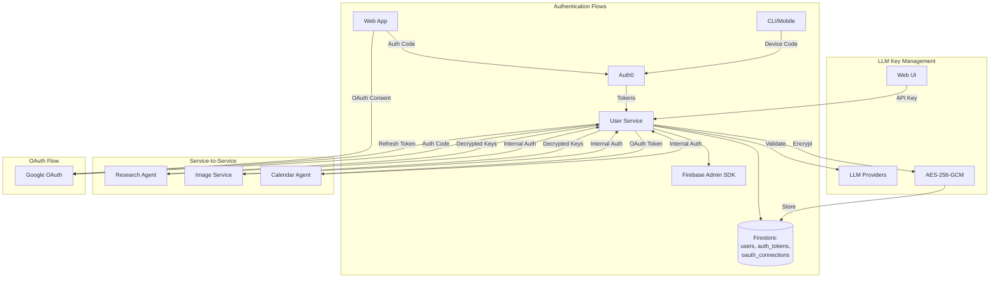
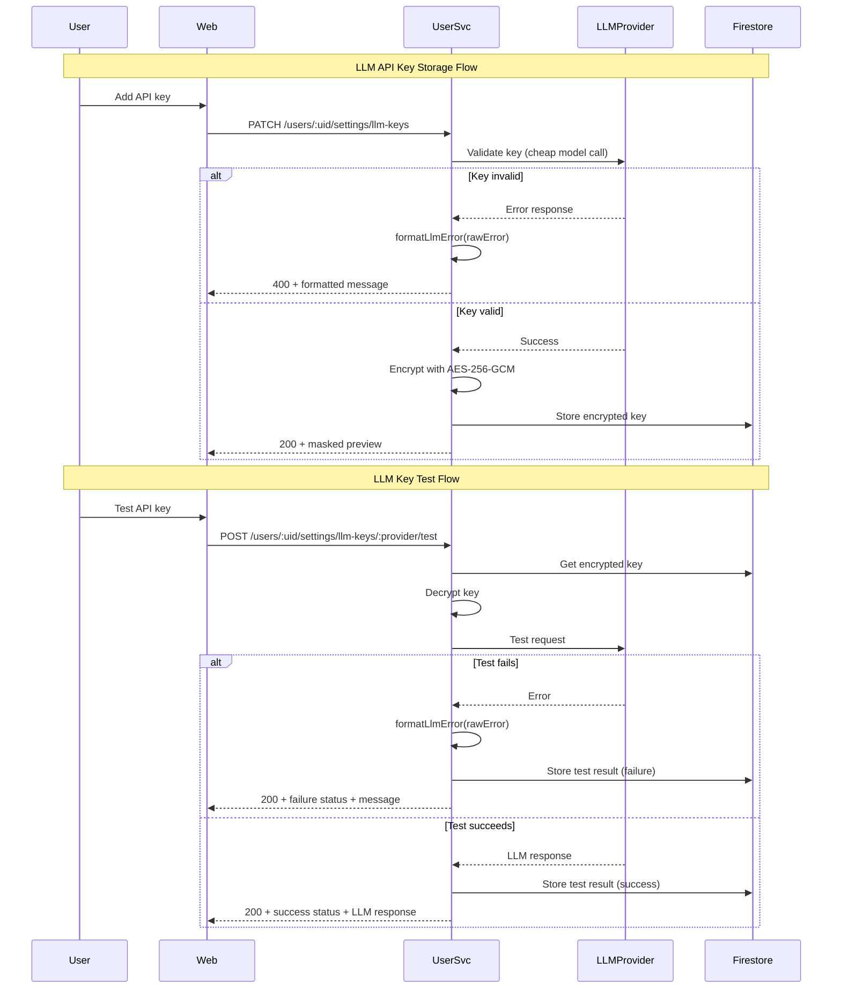

# User Service - Technical Reference

## Overview

User-service provides authentication, user settings management, LLM API key storage with encryption, and OAuth token management. It integrates with Auth0 for identity management and uses AES-256-GCM encryption for all sensitive data.

## Architecture



## Data Flow



## API Endpoints

### Authentication Endpoints

| Method | Path                    | Description                             | Auth         |
| ------ | ----------------------- | --------------------------------------- | ------------ |
| POST   | `/auth/device/start`    | Start device code flow                  | None         |
| POST   | `/auth/device/poll`     | Poll for authentication token           | None         |
| POST   | `/auth/refresh`         | Refresh access token                    | None         |
| POST   | `/auth/oauth/token`     | OAuth token endpoint (ChatGPT Actions)  | None         |
| GET    | `/auth/oauth/authorize` | OAuth authorization endpoint            | None         |
| GET    | `/auth/config`          | Get Auth0 configuration                 | None         |
| POST   | `/auth/firebase-token`  | Exchange Auth0 token for Firebase token | Bearer token |
| GET    | `/auth/me`              | Get current user info                   | Bearer token |
| GET    | `/auth/login`           | Frontend login page                     | None         |
| GET    | `/auth/logout`          | Frontend logout page                    | None         |

### User Settings Endpoints

| Method | Path                                           | Description               | Auth         |
| ------ | ---------------------------------------------- | ------------------------- | ------------ |
| GET    | `/users/:uid/settings`                         | Get user settings         | Bearer token |
| GET    | `/users/:uid/settings/llm-keys`                | Get LLM API keys (masked) | Bearer token |
| PATCH  | `/users/:uid/settings/llm-keys`                | Set/update LLM API key    | Bearer token |
| POST   | `/users/:uid/settings/llm-keys/:provider/test` | Test LLM API key          | Bearer token |
| DELETE | `/users/:uid/settings/llm-keys/:provider`      | Delete LLM API key        | Bearer token |

### OAuth Connection Endpoints

| Method | Path                                 | Description               | Auth         |
| ------ | ------------------------------------ | ------------------------- | ------------ |
| POST   | `/oauth/connections/google/initiate` | Start Google OAuth flow   | Bearer token |
| GET    | `/oauth/connections/google/callback` | Handle OAuth callback     | None         |
| GET    | `/oauth/connections/google/status`   | Get connection status     | Bearer token |
| DELETE | `/oauth/connections/google`          | Disconnect Google account | Bearer token |

### Internal Endpoints

| Method | Path                                                | Description                  | Auth            |
| ------ | --------------------------------------------------- | ---------------------------- | --------------- |
| GET    | `/internal/users/:uid/llm-keys`                     | Get decrypted LLM API keys   | Internal header |
| POST   | `/internal/users/:uid/llm-keys/:provider/last-used` | Update last used timestamp   | Internal header |
| GET    | `/internal/users/:uid/oauth/google/token`           | Get valid Google OAuth token | Internal header |
| GET    | `/internal/users/:uid/settings`                     | Get user LLM preferences     | Internal header |

## Domain Models

### UserSettings

| Field            | Type                 | Description                   |
| ---------------- | -------------------- | ----------------------------- |
| `userId`         | string               | User identifier               |
| `llmApiKeys`     | LlmApiKeys           | AES-256 encrypted API keys    |
| `llmTestResults` | LlmTestResults       | Last test result per provider |
| `llmPreferences` | LlmPreferences       | User's default model settings |
| `notifications`  | NotificationSettings | Notification filter rules     |
| `createdAt`      | string               | Creation timestamp            |
| `updatedAt`      | string               | Last update timestamp         |

### LlmApiKeys

| Field        | Type           | Description                    |
| ------------ | -------------- | ------------------------------ |
| `google`     | EncryptedValue | Gemini API key (encrypted)     |
| `openai`     | EncryptedValue | OpenAI API key (encrypted)     |
| `anthropic`  | EncryptedValue | Anthropic API key (encrypted)  |
| `perplexity` | EncryptedValue | Perplexity API key (encrypted) |
| `zai`        | EncryptedValue | Zai GLM API key (encrypted)    |

### LlmTestResult

| Field      | Type                   | Description           |
| ---------- | ---------------------- | --------------------- |
| `status`   | 'success' \| 'failure' | Test outcome          |
| `message`  | string                 | LLM response or error |
| `testedAt` | string                 | ISO 8601 timestamp    |

### OAuthConnection

| Field       | Type        | Description                |
| ----------- | ----------- | -------------------------- |
| `userId`    | string      | User identifier            |
| `provider`  | 'google'    | OAuth provider             |
| `email`     | string      | User's email from provider |
| `tokens`    | OAuthTokens | Encrypted tokens           |
| `createdAt` | string      | Connection timestamp       |
| `updatedAt` | string      | Last refresh timestamp     |

### OAuthTokens

| Field          | Type   | Description             |
| -------------- | ------ | ----------------------- |
| `accessToken`  | string | Encrypted access token  |
| `refreshToken` | string | Encrypted refresh token |
| `expiresAt`    | string | Access token expiry     |
| `scope`        | string | Granted scopes          |

## LLM Error Formatting (v2.0.0)

The `formatLlmError()` function parses provider-specific error responses and returns user-friendly messages. Error detection follows a specific precedence order.

### Error Parsing Order

```
1. Gemini (Google) JSON format
2. OpenAI error patterns
3. Anthropic JSON format
4. Generic fallback (with rate limit precedence)
```

### Rate Limit Precedence (INT-199 Fix)

The generic error parser checks for rate limits BEFORE API key errors. This prevents 429 responses from being misdiagnosed as invalid keys:

```typescript
// parseGenericError() checks in this order:
1. Rate limit patterns (429, rate_limit, quota exceeded, too many requests)
   -> "Rate limit exceeded. Please try again later."
2. API key patterns (api_key, invalid key)
   -> "The API key for this provider is invalid or expired"
3. Timeout, network, connection
4. Truncate long messages
```

### Provider-Specific Parsing

**Gemini (Google):**

- `API_KEY_INVALID` -> "The API key is invalid or has expired"
- `API_KEY_NOT_FOUND` -> "The API key does not exist"
- `PERMISSION_DENIED` -> "The API key lacks required permissions"
- `RESOURCE_EXHAUSTED` -> "Quota: X tokens/min"

**OpenAI:**

- Rate limit with details -> "tokens: 85000/90000 used, need 10000 more"
- Quota exceeded -> "OpenAI API quota exceeded. Check billing."
- Context length -> "The request exceeds the model's context limit"

**Anthropic:**

- Credit balance error -> "Insufficient Anthropic API credits. Please add funds at console.anthropic.com"
- Rate limit -> "Anthropic API rate limit reached"
- Overloaded -> "Anthropic API is temporarily overloaded"

## LLM Key Validation

Keys are validated before storage using cheap, fast models:

| Provider   | Validation Model |
| ---------- | ---------------- |
| Google     | gemini-2.0-flash |
| OpenAI     | gpt-4o-mini      |
| Anthropic  | claude-3.5-haiku |
| Perplexity | sonar            |
| Zai        | glm-4.7          |

Validation prompt: `Say "API key validated" in exactly 3 words.`

## Pub/Sub Events

None - user-service does not publish or subscribe to Pub/Sub events.

## Dependencies

### External Services

| Service      | Purpose                             |
| ------------ | ----------------------------------- |
| Auth0        | Identity management, authentication |
| Google OAuth | OAuth token management              |
| LLM APIs     | Key validation (5 providers)        |

### Internal Services

| Service        | Communication Direction         |
| -------------- | ------------------------------- |
| research-agent | <- provides decrypted LLM keys  |
| image-service  | <- provides decrypted LLM keys  |
| calendar-agent | <- provides Google OAuth tokens |

### Infrastructure

| Component                                  | Purpose                   |
| ------------------------------------------ | ------------------------- |
| Firestore (`users` collection)             | User settings storage     |
| Firestore (`auth_tokens` collection)       | Auth0 token cache         |
| Firestore (`oauth_connections` collection) | OAuth token storage       |
| Firebase Admin SDK                         | Firebase token generation |

## Configuration

| Environment Variable                    | Required | Description                           |
| --------------------------------------- | -------- | ------------------------------------- |
| `INTEXURAOS_AUTH0_DOMAIN`               | Yes      | Auth0 tenant domain                   |
| `INTEXURAOS_AUTH0_CLIENT_ID`            | Yes      | Auth0 application client ID           |
| `INTEXURAOS_AUTH0_CLIENT_SECRET`        | Yes      | Auth0 application client secret       |
| `INTEXURAOS_AUTH0_AUDIENCE`             | Yes      | Auth0 API identifier                  |
| `INTEXURAOS_INTERNAL_AUTH_TOKEN`        | Yes      | Shared secret for internal endpoints  |
| `INTEXURAOS_ENCRYPTION_KEY`             | Yes      | AES-256 encryption key (32 bytes hex) |
| `INTEXURAOS_GOOGLE_OAUTH_CLIENT_ID`     | No       | Google OAuth client ID                |
| `INTEXURAOS_GOOGLE_OAUTH_CLIENT_SECRET` | No       | Google OAuth client secret            |
| `INTEXURAOS_FIREBASE_PROJECT_ID`        | Yes      | Firebase project ID                   |
| `INTEXURAOS_FIREBASE_CLIENT_EMAIL`      | Yes      | Firebase service account email        |
| `INTEXURAOS_FIREBASE_PRIVATE_KEY`       | Yes      | Firebase service account private key  |
| `INTEXURAOS_WEB_APP_URL`                | No       | Web app URL for OAuth redirects       |

## Gotchas

**Encryption key format**: The `INTEXURAOS_ENCRYPTION_KEY` must be exactly 64 hex characters (32 bytes) for AES-256-GCM.

**Token refresh timing**: Refresh tokens are exchanged when they're within 5 minutes of expiration to prevent edge cases.

**Internal auth header**: The `X-Internal-Auth` header must match `INTEXURAOS_INTERNAL_AUTH_TOKEN` exactly for service-to-service calls.

**Device code polling**: The `interval` from Auth0's device code response should be respected to avoid rate limiting.

**OAuth token refresh**: If refresh fails (token revoked), the connection is marked invalid but not deleted. User must re-authenticate.

**API key masking**: In logs and API responses, keys are masked showing only first 4 and last 4 characters.

**LLM key testing costs money**: The `/test` endpoint validates keys by making actual API calls to the provider.

**Rate limit vs API key errors**: Error parser checks rate limits before API key patterns to avoid misdiagnosis (v2.0.0 fix).

**Provider naming**: Internal provider names (`google`, `openai`, `anthropic`, `perplexity`, `zai`) differ from display names.

## File Structure

```
apps/user-service/src/
  domain/
    identity/
      models/
        AuthToken.ts           # Auth token types
      ports/
        Auth0Client.ts         # Auth0 interface
        AuthTokenRepository.ts # Token storage interface
      usecases/
        refreshAccessToken.ts  # Token refresh logic
    settings/
      models/
        UserSettings.ts        # Settings aggregate
      ports/
        UserSettingsRepository.ts # Settings storage
        Encryptor.ts           # Encryption interface
        LlmValidator.ts        # Key validation interface
      usecases/
        getUserSettings.ts     # Get settings use case
      formatLlmError.ts        # Error message formatting
      maskApiKey.ts            # Key masking utility
    oauth/
      models/
        OAuthConnection.ts     # OAuth connection types
      ports/
        GoogleOAuthClient.ts   # Google OAuth interface
        OAuthConnectionRepository.ts
      usecases/
        initiateOAuthFlow.ts   # Start OAuth
        exchangeOAuthCode.ts   # Exchange code for tokens
        getValidAccessToken.ts # Get/refresh access token
        disconnectProvider.ts  # Revoke OAuth connection
  infra/
    auth0/
      client.ts                # Auth0 SDK wrapper
    encryption.ts              # AES-256-GCM implementation
    firebase/
      admin.ts                 # Firebase Admin SDK
    firestore/
      authTokenRepository.ts   # Token storage
      userSettingsRepository.ts # Settings storage
      oauthConnectionRepository.ts
    google/
      googleOAuthClient.ts     # Google OAuth client
    llm/
      LlmValidatorImpl.ts      # Key validation (5 providers)
  routes/
    deviceRoutes.ts            # Device code flow
    tokenRoutes.ts             # Token refresh
    firebaseRoutes.ts          # Firebase token exchange
    oauthRoutes.ts             # OAuth endpoints
    oauthConnectionRoutes.ts   # OAuth connection management
    configRoutes.ts            # Auth0 config
    settingsRoutes.ts          # User settings CRUD
    llmKeysRoutes.ts           # LLM key management
    frontendRoutes.ts          # Login/logout pages
    internalRoutes.ts          # Service-to-service
  services.ts                  # DI container
```
