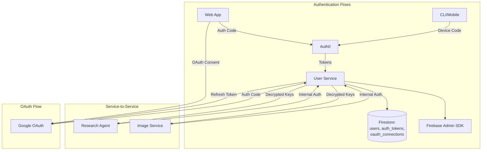
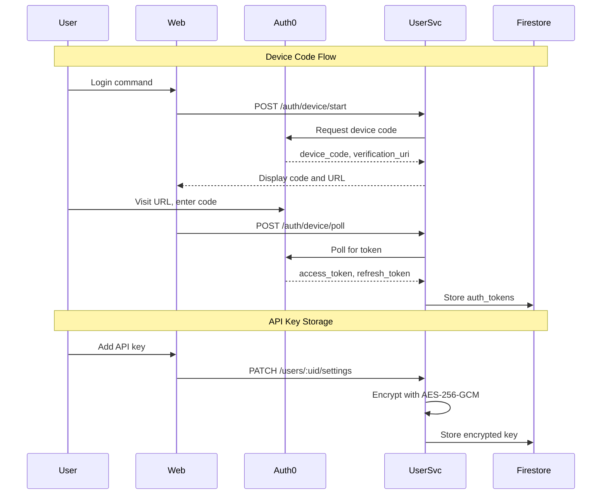

# User Service - Technical Reference

## Overview

User-service provides authentication, user settings management, and secure API key storage for IntexuraOS. It integrates with Auth0 for identity management and uses AES-256-GCM encryption for sensitive data.

## Architecture



## Data Flow



## API Endpoints

### Authentication Endpoints

| Method   | Path                    | Description                             | Auth         |
| --------  | -----------------------  | ---------------------------------------  | ------------  |
| POST     | `/auth/device/start`    | Start device code flow                  | None         |
| POST     | `/auth/device/poll`     | Poll for authentication token           | None         |
| POST     | `/auth/refresh`         | Refresh access token                    | None         |
| POST     | `/auth/oauth/token`     | OAuth token endpoint (ChatGPT Actions)  | None         |
| GET      | `/auth/oauth/authorize` | OAuth authorization endpoint            | None         |
| GET      | `/auth/config`          | Get Auth0 configuration                 | None         |
| POST     | `/auth/firebase-token`  | Exchange Auth0 token for Firebase token | Bearer token |
| GET      | `/auth/me`              | Get current user info                   | Bearer token |
| GET      | `/auth/login`           | Frontend login page                     | None         |
| GET      | `/auth/logout`          | Frontend logout page                    | None         |

### User Settings Endpoints

| Method   | Path                                     | Description               | Auth         |
| --------  | ----------------------------------------  | -------------------------  | ------------  |
| GET      | `/users/:uid/settings`                   | Get user settings         | Bearer token |
| PATCH    | `/users/:uid/settings`                   | Update user settings      | Bearer token |
| PUT      | `/users/:uid/llm-keys`                   | Update LLM API keys       | Bearer token |
| DELETE   | `/users/:uid/llm-keys/:provider`         | Delete LLM API key        | Bearer token |
| GET      | `/users/:uid/llm-keys/test`              | Test LLM API key          | Bearer token |
| GET      | `/users/:uid/oauth-connections`          | List OAuth connections    | Bearer token |
| POST     | `/users/:uid/oauth/:provider/disconnect` | Disconnect OAuth provider | Bearer token |

### Internal Endpoints

| Method   | Path                                                | Description                  | Auth            |
| --------  | ---------------------------------------------------  | ----------------------------  | ---------------  |
| GET      | `/internal/users/:uid/llm-keys`                     | Get decrypted LLM API keys   | Internal header |
| POST     | `/internal/users/:uid/llm-keys/:provider/last-used` | Update last used timestamp   | Internal header |
| GET      | `/internal/users/:uid/oauth/google/token`           | Get valid Google OAuth token | Internal header |
| POST     | `/internal/users/:uid/llm-keys/validate`            | Validate LLM API key         | Internal header |
| POST     | `/internal/users/:uid/llm-keys/success`             | Report LLM usage success     | Internal header |

## Domain Models

### AuthToken

| Field          | Type   | Description                |
| --------------  | ------  | --------------------------  |
| `userId`       | string | User identifier            |
| `accessToken`  | string | Auth0 access token         |
| `refreshToken` | string | Auth0 refresh token        |
| `idToken`      | string | Auth0 ID token             |
| `expiresAt`    | string | Token expiration timestamp |
| `scope`        | string | Granted scopes             |
| `createdAt`    | string | Creation timestamp         |

### UserSettings

| Field            | Type                              | Description                   |
| ----------------  | ---------------------------------  | -----------------------------  |
| `userId`         | string                            | User identifier               |
| `llmApiKeys`     | Record\<LlmProvider, string\>     | AES-256 encrypted API keys    |
| `llmTestResults` | Record\<LlmProvider, TestResult\> | Last test result per provider |
| `createdAt`      | string                            | Creation timestamp            |
| `updatedAt`      | string                            | Last update timestamp         |

### TestResult

| Field          | Type      | Description              |
| --------------  | ---------  | ------------------------  |
| `status`       | 'valid' \ | 'invalid' \              | 'pending' \ | 'error' |
| `testedAt`     | string    | ISO 8601 timestamp       |
| `errorMessage` | string    | Error details if invalid |

### OAuthConnection

| Field          | Type       | Description                |
| --------------  | ----------  | --------------------------  |
| `id`           | string     | Connection ID              |
| `userId`       | string     | User identifier            |
| `provider`     | 'google' \ | 'microsoft'                |
| `accessToken`  | string     | Encrypted access token     |
| `refreshToken` | string     | Encrypted refresh token    |
| `expiresAt`    | string     | Access token expiry        |
| `email`        | string     | User's email from provider |
| `scope`        | string[]   | Granted scopes             |
| `connectedAt`  | string     | Connection timestamp       |

## LLM Providers

| Provider     | Key Name                    |
| ------------  | ---------------------------  |
| `google`     | Google AI API key (Gemini)  |
| `openai`     | OpenAI API key (GPT models) |
| `anthropic`  | Anthropic API key (Claude)  |
| `perplexity` | Perplexity API key          |

## Pub/Sub Events

None - user-service does not publish or subscribe to Pub/Sub events.

## Dependencies

### External Services

| Service      | Purpose                             |
| ------------  | -----------------------------------  |
| Auth0        | Identity management, authentication |
| Google OAuth | OAuth token management              |

### Infrastructure

| Component                                  | Purpose                   |
| ------------------------------------------  | -------------------------  |
| Firestore (`users` collection)             | User settings storage     |
| Firestore (`auth_tokens` collection)       | Auth0 token cache         |
| Firestore (`oauth_connections` collection) | OAuth token storage       |
| Firebase Admin SDK                         | Firebase token generation |

## Configuration

| Environment Variable                    | Required   | Description                           |
| ---------------------------------------  | ----------  | -------------------------------------  |
| `INTEXURAOS_AUTH0_DOMAIN`               | Yes        | Auth0 tenant domain                   |
| `INTEXURAOS_AUTH0_CLIENT_ID`            | Yes        | Auth0 application client ID           |
| `INTEXURAOS_AUTH0_CLIENT_SECRET`        | Yes        | Auth0 application client secret       |
| `INTEXURAOS_AUTH0_AUDIENCE`             | Yes        | Auth0 API identifier                  |
| `INTEXURAOS_INTERNAL_AUTH_TOKEN`        | Yes        | Shared secret for internal endpoints  |
| `INTEXURAOS_ENCRYPTION_KEY`             | Yes        | AES-256 encryption key (32 bytes hex) |
| `INTEXURAOS_GOOGLE_OAUTH_CLIENT_ID`     | No         | Google OAuth client ID                |
| `INTEXURAOS_GOOGLE_OAUTH_CLIENT_SECRET` | No         | Google OAuth client secret            |
| `INTEXURAOS_FIREBASE_PROJECT_ID`        | Yes        | Firebase project ID                   |
| `INTEXURAOS_FIREBASE_CLIENT_EMAIL`      | Yes        | Firebase service account email        |
| `INTEXURAOS_FIREBASE_PRIVATE_KEY`       | Yes        | Firebase service account private key  |

## Gotchas

**Encryption key format**: The `INTEXURAOS_ENCRYPTION_KEY` must be exactly 64 hex characters (32 bytes) for AES-256-GCM.

**Token refresh timing**: Refresh tokens are exchanged when they're within 5 minutes of expiration to prevent edge cases.

**Internal auth header**: The `X-Internal-Auth` header must match `INTEXURAOS_INTERNAL_AUTH_TOKEN` exactly for service-to-service calls.

**Device code polling**: The `interval` from Auth0's device code response should be respected to avoid rate limiting.

**OAuth token refresh**: If refresh fails (token revoked), the connection is marked invalid but not deleted. User must re-authenticate.

**API key masking**: In logs and error messages, API keys are masked showing only first 8 and last 4 characters.

**Firebase token exchange**: Auth0 tokens are exchanged for Firebase tokens via custom minting, not Firebase Authentication.

**LLM key testing**: The `/test` endpoint validates keys by making actual API calls to the provider, which costs money.

**Provider naming**: The internal provider names (`google`, `openai`, `anthropic`, `perplexity`) differ from some display names.

## File Structure

```
apps/user-service/src/
  domain/
    identity/
      models/
        AuthToken.ts
        AuthError.ts
      ports/
        Auth0Client.ts
        AuthTokenRepository.ts
      usecases/
        refreshAccessToken.ts
    settings/
      models/
        UserSettings.ts
        SettingsError.ts
      ports/
        UserSettingsRepository.ts
        LlmValidator.ts
      usecases/
        getUserSettings.ts
      utils/
        maskApiKey.ts
        formatLlmError.ts
    oauth/
      models/
        OAuthConnection.ts
        OAuthError.ts
      ports/
        GoogleOAuthClient.ts
        OAuthConnectionRepository.ts
      usecases/
        initiateOAuthFlow.ts
        exchangeOAuthCode.ts
        getValidAccessToken.ts
        disconnectProvider.ts
  infra/
    auth0/
      client.ts
    encryption.ts
    firebase/
      admin.ts
    firestore/
      authTokenRepository.ts
      userSettingsRepository.ts
      oauthConnectionRepository.ts
    google/
      googleOAuthClient.ts
    llm/
      LlmValidatorImpl.ts
  routes/
    deviceRoutes.ts         # Device code flow
    tokenRoutes.ts          # Token refresh
    firebaseRoutes.ts       # Firebase token exchange
    oauthRoutes.ts          # OAuth endpoints
    configRoutes.ts         # Auth0 config
    settingsRoutes.ts       # User settings
    llmKeysRoutes.ts        # LLM key management
    oauthConnectionRoutes.ts
    frontendRoutes.ts       # Login/logout pages
    internalRoutes.ts       # Service-to-service
  services.ts               # DI container
```
