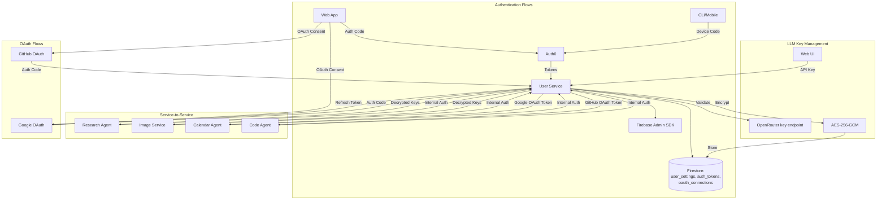
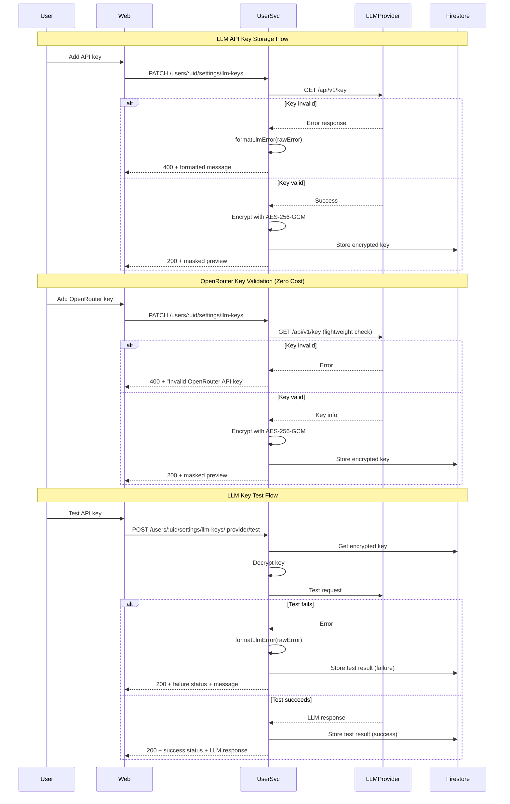

# User Service — Technical Reference

## Overview

User-service provides authentication, user settings management, LLM API key storage with encryption, and OAuth token management for Google and GitHub. It integrates with Auth0 for identity management and uses AES-256-GCM encryption for all sensitive data. Runs on Cloud Run with Fastify.

## Architecture


```mermaid
graph TB
    subgraph "Authentication Flows"
        Web[Web App] -->|Auth Code| A0[Auth0]
        CLI[CLI/Mobile] -->|Device Code| A0
        A0 -->|Tokens| US[User Service]

        US --> FS[(Firestore:<br/>user_settings, auth_tokens,<br/>oauth_connections)]
        US --> FB[Firebase Admin SDK]
    end

    subgraph "LLM Key Management"
        WebUI[Web UI] -->|API Key| US
        US -->|Validate| LLM[OpenRouter key endpoint]
        US -->|Encrypt| KMS[AES-256-GCM]
        KMS -->|Store| FS
    end

    subgraph "Service-to-Service"
        RA[Research Agent] -->|Internal Auth| US
        IA[Image Service] -->|Internal Auth| US
        CA[Calendar Agent] -->|Internal Auth| US
        CD[Code Agent] -->|Internal Auth| US
        US -->|Decrypted Keys| RA
        US -->|Decrypted Keys| IA
        US -->|Google OAuth Token| CA
        US -->|GitHub OAuth Token| CD
    end

    subgraph "OAuth Flows"
        Web -->|OAuth Consent| Google[Google OAuth]
        Google -->|Auth Code| US
        US -->|Refresh Token| Google

        Web -->|OAuth Consent| GitHub[GitHub OAuth]
        GitHub -->|Auth Code| US
    end
```

## Data Flow


```mermaid
sequenceDiagram
    participant User
    participant Web
    participant UserSvc
    participant LLMProvider
    participant Firestore

    Note over User,Firestore: LLM API Key Storage Flow
    User->>Web: Add API key
    Web->>UserSvc: PATCH /users/:uid/settings/llm-keys
    UserSvc->>LLMProvider: GET /api/v1/key
    alt Key invalid
        LLMProvider-->>UserSvc: Error response
        UserSvc->>UserSvc: formatLlmError(rawError)
        UserSvc-->>Web: 400 + formatted message
    else Key valid
        LLMProvider-->>UserSvc: Success
        UserSvc->>UserSvc: Encrypt with AES-256-GCM
        UserSvc->>Firestore: Store encrypted key
        UserSvc-->>Web: 200 + masked preview
    end

    Note over User,Firestore: OpenRouter Key Validation (Zero Cost)
    User->>Web: Add OpenRouter key
    Web->>UserSvc: PATCH /users/:uid/settings/llm-keys
    UserSvc->>LLMProvider: GET /api/v1/key (lightweight check)
    alt Key invalid
        LLMProvider-->>UserSvc: Error
        UserSvc-->>Web: 400 + "Invalid OpenRouter API key"
    else Key valid
        LLMProvider-->>UserSvc: Key info
        UserSvc->>UserSvc: Encrypt with AES-256-GCM
        UserSvc->>Firestore: Store encrypted key
        UserSvc-->>Web: 200 + masked preview
    end

    Note over User,Firestore: LLM Key Test Flow
    User->>Web: Test API key
    Web->>UserSvc: POST /users/:uid/settings/llm-keys/:provider/test
    UserSvc->>Firestore: Get encrypted key
    UserSvc->>UserSvc: Decrypt key
    UserSvc->>LLMProvider: Test request
    alt Test fails
        LLMProvider-->>UserSvc: Error
        UserSvc->>UserSvc: formatLlmError(rawError)
        UserSvc->>Firestore: Store test result (failure)
        UserSvc-->>Web: 200 + failure status + message
    else Test succeeds
        LLMProvider-->>UserSvc: LLM response
        UserSvc->>Firestore: Store test result (success)
        UserSvc-->>Web: 200 + success status + LLM response
    end
```

## Recent Changes

### Changes Since v3.8.0

- `PATCH /users/:uid/settings` accepts a separate Intex selector body containing exactly `intexAgentModel` (supported model or `null`) and `expectedRevision`. Stale revisions conflict; mixed selector/general-model patches are invalid.
- `GET /users/:uid/settings/llm-keys` includes selector availability and, when available, explicit/effective model and revision. Availability requires the configured subject and fresh conformant catalog evidence.
- `GET /internal/users/:uid/settings/intex-agent-runtime` exposes the effective model and time zone for the runtime; unavailable selection uses the platform default.
- User settings expose the independent Test Runs read capability for the configured evaluator. The actual run evidence belongs to intex-agent.
- Active LLM configuration uses OpenRouter. Personal key deletion removes the key and test result without clearing model preferences, allowing platform fallback. Earlier release notes below describe historical behavior.

### v3.6.0

- **Primary + fallback LLM model selection** (INT-1362, PRs #1793, #1789): Added `fallbackModel` to `LlmPreferences` domain model. `PATCH /users/:uid/settings` now accepts an optional `fallbackModel` field. The service validates that fallback differs from default, that the user has an API key for the fallback provider, and that the model passes `isDefaultEligibleModel()`. Deleting an API key cascades to clear both `defaultModel` and `fallbackModel` if either depends on the deleted provider. Internal `GET /internal/users/:uid/settings` now returns `fallbackModel` alongside `defaultModel`. GET `/users/:uid/settings/llm-keys` returns `fallbackModel` in the response.
- **Centralized LLM pricing removal** (INT-1387, PR #1831): Removed the `llm-pricing` startup dependency that fetched pricing from `app-settings-service`. Replaced with `HttpInternalAuthUsageSink` that reports usage to `llm-usage-service` asynchronously. The service no longer fails to start if pricing data is unavailable.
- **`promptType` required in LLM calls** (INT-1392): All `generate()` calls via `LlmValidatorImpl` now pass a semantic `promptType` string for usage tracking.
- **Model validation renamed**: `isFastModel()` replaced with `isDefaultEligibleModel()` from `@intexuraos/llm-contract`, broadening the set of models eligible for default/fallback selection.

| Commit      | Description                                                              | Date       |
| ----------- | ------------------------------------------------------------------------ | ---------- |
| `dedd0e3`   | Strengthen test assertions to verify semantic promptType (INT-1392)      | 2026-04-17 |
| `8aae64e`   | Make promptType required in LlmGenerateClient and all callers (INT-1392) | 2026-04-17 |
| `a4f53cd`   | Remove LLM pricing from 9 remaining apps + delete deprecated (INT-1387)  | 2026-04-15 |
| `d778333`   | Add nullable to fallbackModel schema in internal route                   | 2026-04-14 |
| `26ef235`   | Resolve uncovered branches in fallback model feature                     | 2026-04-14 |
| `5ac6f86`   | Address code review feedback for fallback model feature                  | 2026-04-14 |
| `37fc477`   | Remove unnecessary optional chain in settings routes                     | 2026-04-14 |
| `c42bea7`   | Add fallbackModel to LlmPreferences domain model                         | 2026-04-14 |
| `830d5a9`   | Add retry with exponential backoff to pricing fetch (llm-pricing)        | 2026-04-13 |
| `8b1211d`   | Wire HttpInternalAuthUsageSink in all LLM callers (INT-1342)             | 2026-04-12 |

## API Endpoints

### Authentication Endpoints

| Method | Path                    | Description                             | Auth         |
| ------ | ----------------------- | --------------------------------------- | ------------ |
| POST   | `/auth/device/start`    | Start device code flow                  | None         |
| POST   | `/auth/device/poll`     | Poll for authentication token           | None         |
| POST   | `/auth/refresh`         | Refresh access token                    | None         |
| POST   | `/auth/oauth/token`     | OAuth token endpoint (ChatGPT Actions)  | None         |
| GET    | `/auth/oauth/authorize` | OAuth authorization endpoint            | None         |
| GET    | `/auth/config`          | Get Auth0 configuration                 | None         |
| POST   | `/auth/firebase-token`  | Exchange Auth0 token for Firebase token | Bearer token |
| GET    | `/auth/me`              | Get current user info                   | Bearer token |
| GET    | `/auth/login`           | Frontend login redirect                 | None         |
| GET    | `/auth/logout`          | Frontend logout redirect                | None         |

### User Settings Endpoints

| Method | Path                                            | Description                              | Auth         |
| ------ | ----------------------------------------------- | ---------------------------------------- | ------------ |
| GET    | `/users/:uid/settings`                          | Get user settings                        | Bearer token |
| PATCH  | `/users/:uid/settings`                          | Update default + fallback LLM model      | Bearer token |
| PATCH  | `/users/:uid/settings/transcription`            | Update transcription provider preference | Bearer token |
| PATCH  | `/users/:uid/settings/timezone`                 | Update timezone preference               | Bearer token |
| GET    | `/users/:uid/settings/llm-keys`                 | Get LLM API keys (masked) + model prefs  | Bearer token |
| PATCH  | `/users/:uid/settings/llm-keys`                 | Set/update LLM API key                   | Bearer token |
| POST   | `/users/:uid/settings/llm-keys/:provider/test`  | Test LLM API key                         | Bearer token |
| DELETE | `/users/:uid/settings/llm-keys/:provider`       | Delete LLM API key                       | Bearer token |

PATCH, test, and normal deletion accept only OpenRouter. Retired provider fields can remain in stored documents and compatibility responses, but active clients do not use them. Google OAuth routes below are unchanged and are used for Calendar access, not LLM execution.

### OAuth Connection Endpoints (Google)

| Method | Path                                 | Description               | Auth         |
| ------ | ------------------------------------ | ------------------------- | ------------ |
| POST   | `/oauth/connections/google/initiate` | Start Google OAuth flow   | Bearer token |
| GET    | `/oauth/connections/google/callback` | Handle OAuth callback     | None         |
| GET    | `/oauth/connections/google/status`   | Get connection status     | Bearer token |
| DELETE | `/oauth/connections/google`          | Disconnect Google account | Bearer token |

### OAuth Connection Endpoints (GitHub)

| Method | Path                                 | Description               | Auth         |
| ------ | ------------------------------------ | ------------------------- | ------------ |
| POST   | `/oauth/connections/github/initiate` | Start GitHub OAuth flow   | Bearer token |
| GET    | `/oauth/connections/github/callback` | Handle OAuth callback     | None         |
| GET    | `/oauth/connections/github/status`   | Get connection status     | Bearer token |
| DELETE | `/oauth/connections/github`          | Disconnect GitHub account | Bearer token |

### Internal Endpoints

| Method | Path                                                | Description                     | Auth            |
| ------ | --------------------------------------------------- | ------------------------------- | --------------- |
| GET    | `/internal/users/:uid/llm-keys`                     | Get decrypted LLM API keys      | Internal header |
| POST   | `/internal/users/:uid/llm-keys/:provider/last-used` | Update last used timestamp      | Internal header |
| GET    | `/internal/users/:uid/oauth/google/token`           | Get valid Google OAuth token    | Internal header |
| GET    | `/internal/users/:uid/oauth/github/token`           | Get GitHub OAuth token          | Internal header |
| GET    | `/internal/users/:uid/settings`                     | Get user preferences            | Internal header |
| GET    | `/internal/users/by-github-username/:username`      | Find user by GitHub username    | Internal header |

## Domain Models

### UserSettings

| Field                        | Type                      | Description                           |
| ---------------------------- | ------------------------- | ------------------------------------- |
| `userId`                     | string                    | User identifier                       |
| `llmApiKeys`                 | LlmApiKeys                | AES-256 encrypted API keys            |
| `llmTestResults`             | LlmTestResults            | Last test result per provider         |
| `llmPreferences`             | LlmPreferences            | User's default + fallback model       |
| `transcriptionPreferences`   | TranscriptionPreferences  | User's transcription provider         |
| `timezone`                   | string                    | IANA timezone (e.g., "Europe/Berlin") |
| `notifications`              | NotificationSettings      | Notification filter rules             |
| `createdAt`                  | string                    | Creation timestamp                    |
| `updatedAt`                  | string                    | Last update timestamp                 |

### LlmApiKeys

| Field        | Type           | Description                     |
| ------------ | -------------- | ------------------------------- |
| `google`     | EncryptedValue | Retired compatibility field; not executable |
| `openai`     | EncryptedValue | Retired compatibility field; not executable |
| `anthropic`  | EncryptedValue | Retired compatibility field; not executable |
| `perplexity` | EncryptedValue | Retired compatibility field; not executable |
| `openrouter` | EncryptedValue | Active OpenRouter API key (encrypted)        |

### LlmTestResult

| Field      | Type                       | Description           |
| ---------- | -------------------------- | --------------------- |
| `status`   | `'success' \               | 'failure'`            | Test outcome |
| `message`  | string                     | LLM response or error |
| `testedAt` | string                     | ISO 8601 timestamp    |

### LlmPreferences

| Field           | Type   | Description                                               |
| --------------- | ------ | --------------------------------------------------------- |
| `defaultModel`  | string | User's preferred default LLM model                        |
| `fallbackModel` | string | Optional fallback model (different model from default)    |

### TranscriptionPreferences

| Field      | Type                  | Description                    |
| ---------- | --------------------- | ------------------------------ |
| `provider` | TranscriptionProvider | `'speechmatics'` (only option) |

### OAuthConnection

| Field       | Type                       | Description              |
| ----------- | -------------------------- | ------------------------ |
| `userId`    | string                     | User identifier          |
| `provider`  | `'google' \                | 'github'`                | OAuth provider |
| `email`     | string                     | User's email or username |
| `tokens`    | OAuthTokens                | Encrypted tokens         |
| `createdAt` | string                     | Connection timestamp     |
| `updatedAt` | string                     | Last refresh timestamp   |

### OAuthTokens

| Field          | Type   | Description                                   |
| -------------- | ------ | --------------------------------------------- |
| `accessToken`  | string | Encrypted access token                        |
| `refreshToken` | string | Encrypted refresh token (empty for GitHub)    |
| `expiresAt`    | string | Access token expiry (far-future for GitHub)   |
| `scope`        | string | Granted scopes                                |

### AuthTokens

| Field          | Type   | Description                    |
| -------------- | ------ | ------------------------------ |
| `accessToken`  | string | Auth0 access token             |
| `refreshToken` | string | Auth0 refresh token            |
| `tokenType`    | string | Token type (Bearer)            |
| `expiresIn`    | number | Expiry in seconds              |
| `scope`        | string | Granted scopes (optional)      |
| `idToken`      | string | OIDC ID token (optional)       |

## LLM Error Formatting

The `formatLlmError()` function parses provider-specific error responses and returns user-friendly messages. Error detection follows a specific precedence order.

### Error Parsing Order

```
1. Compatibility parser for legacy Google error payloads
2. OpenAI error patterns
3. Anthropic JSON format
4. Generic fallback (with rate limit precedence)
```

### Rate Limit Precedence

The generic error parser checks for rate limits BEFORE API key errors. This prevents 429 responses from being misdiagnosed as invalid keys:

```typescript
// parseGenericError() checks in this order:
1. Rate limit patterns (429, rate_limit, quota exceeded, too many requests)
   -> "Rate limit exceeded. Please try again later."
2. API key patterns (api_key, invalid key)
   -> "The API key for this provider is invalid or expired"
3. Timeout, network, connection
4. Truncate long messages
```

### Provider-Specific Parsing

**Legacy Google compatibility (not an executable provider):**

- `API_KEY_INVALID` -> "The API key is invalid or has expired"
- `API_KEY_NOT_FOUND` -> "The API key does not exist"
- `PERMISSION_DENIED` -> "The API key lacks required permissions"
- `RESOURCE_EXHAUSTED` -> "Quota: X tokens/min"

**OpenAI:**

- Rate limit with details -> "tokens: 85000/90000 used, need 10000 more"
- Quota exceeded -> "OpenAI API quota exceeded. Check billing."
- Context length -> "The request exceeds the model's context limit"

**Anthropic:**

- Credit balance error -> "Insufficient Anthropic API credits. Please add funds at console.anthropic.com"
- Rate limit -> "Anthropic API rate limit reached"
- Overloaded -> "Anthropic API is temporarily overloaded"

## LLM Key Validation

OpenRouter keys are validated before storage with the dedicated key-check endpoint at zero token cost. Direct OpenAI, Anthropic, Perplexity, and Google LLM keys cannot be added or tested; their model families are addressed with `or:<vendor>/...` identifiers and sent through OpenRouter.

| Provider   | Validation Method                  | Validation Model    |
| ---------- | ---------------------------------- | ------------------- |
| OpenRouter | Lightweight `/api/v1/key` endpoint | N/A (no model call) |

## Pub/Sub Events

None — user-service does not publish or subscribe to Pub/Sub events.

## Dependencies

### External Services

| Service       | Purpose                             |
| ------------- | ----------------------------------- |
| Auth0         | Identity management, authentication |
| Google OAuth  | OAuth token management              |
| GitHub OAuth  | OAuth token management              |
| OpenRouter API | Key validation through `/api/v1/key`      |

### Internal Services

| Service           | Communication Direction                 |
| ----------------- | --------------------------------------- |
| research-agent    | <- provides decrypted LLM keys          |
| image-service     | <- provides decrypted LLM keys          |
| calendar-agent    | <- provides Google OAuth tokens         |
| code-agent        | <- provides GitHub OAuth tokens         |
| llm-usage-service | -> reports LLM usage for key validation |

### Infrastructure

| Component                                  | Purpose                             |
| ------------------------------------------ | ----------------------------------- |
| Firestore (`user_settings` collection)     | User settings storage               |
| Firestore (`auth_tokens` collection)       | Auth0 token cache                   |
| Firestore (`oauth_connections` collection) | OAuth token storage                 |
| Firebase Admin SDK                         | Firebase token generation           |

## Configuration

| Environment Variable                    | Required | Description                                               |
| --------------------------------------- | -------- | --------------------------------------------------------- |
| `INTEXURAOS_GCP_PROJECT_ID`             | Yes      | GCP project ID (Firestore, Firebase)                      |
| `INTEXURAOS_AUTH0_DOMAIN`               | Yes      | Auth0 tenant domain                                       |
| `INTEXURAOS_AUTH0_CLIENT_ID`            | Yes      | Auth0 application client ID                               |
| `INTEXURAOS_AUTH_JWKS_URL`              | Yes      | Auth0 JWKS endpoint for JWT verification                  |
| `INTEXURAOS_AUTH_ISSUER`                | Yes      | JWT issuer (Auth0 tenant URL)                             |
| `INTEXURAOS_AUTH_AUDIENCE`              | Yes      | JWT audience (API identifier)                             |
| `INTEXURAOS_TOKEN_ENCRYPTION_KEY`       | Yes      | Key for encrypting stored Auth0 tokens                    |
| `INTEXURAOS_ENCRYPTION_KEY`             | Yes      | AES-256 key for API key encryption (64 hex chars)         |
| `INTEXURAOS_INTERNAL_AUTH_TOKEN`        | Yes      | Shared secret for internal endpoints                      |
| `INTEXURAOS_LLM_USAGE_SERVICE_URL`      | Yes      | URL of llm-usage-service (reports LLM usage)              |
| `INTEXURAOS_WEB_APP_URL`                | Yes      | Web app URL for OAuth redirects                           |
| `INTEXURAOS_GOOGLE_OAUTH_CLIENT_ID`     | Yes      | Google OAuth client ID                                    |
| `INTEXURAOS_GOOGLE_OAUTH_CLIENT_SECRET` | Yes      | Google OAuth client secret                                |
| `INTEXURAOS_GITHUB_OAUTH_CLIENT_ID`     | Yes      | GitHub OAuth client ID                                    |
| `INTEXURAOS_GITHUB_OAUTH_CLIENT_SECRET` | Yes      | GitHub OAuth client secret                                |
| `INTEXURAOS_SENTRY_DSN`                 | No       | Sentry DSN for error tracking (optional)                  |

Configuration also includes `INTEXURAOS_INTEX_AGENT_MODEL_SELECTOR_USER_ID` (exact eligible subject or `disabled`) and `INTEXURAOS_INTEX_AGENT_TEST_RUNS_READ_ENABLED` (`true` or `false`). Enabled selection requires `INTEXURAOS_OPENROUTER_APP_API_KEY`. Enabled Test Runs require `INTEXURAOS_MATRIX_CORPUS_RUNTIME_AUDIENCE=hetzner-prod` and `INTEXURAOS_MATRIX_CORPUS_EVALUATOR_USER_ID`.

## Gotchas

**Encryption key format**: The `INTEXURAOS_ENCRYPTION_KEY` must be exactly 64 hex characters (32 bytes) for AES-256-GCM.

**Token refresh timing**: Refresh tokens are exchanged when they're within 5 minutes of expiration to prevent edge cases.

**Internal auth header**: The `X-Internal-Auth` header must match `INTEXURAOS_INTERNAL_AUTH_TOKEN` exactly for service-to-service calls.

**Device code polling**: The `interval` from Auth0's device code response should be respected to avoid rate limiting.

**OAuth token refresh**: If Google refresh fails (token revoked), the connection is deleted and user must reconnect. GitHub tokens never expire unless revoked.

**API key masking**: In logs and API responses, keys are masked showing only first 4 and last 4 characters.

**Validation versus testing**: Saving an OpenRouter key uses the zero-token key-check endpoint. Explicit `/test` calls generate a short response and can incur usage.

**Rate limit vs API key errors**: Error parser checks rate limits before API key patterns to avoid misdiagnosis.

**Retired provider names**: Historical types and records can still contain `google`, `openai`, `anthropic`, or `perplexity`; active settings and execution use `openrouter`.

**Internal endpoints use response contract**: All internal endpoints return `{ success: true, data: ... }` or `{ success: false, error: { code, message } }`. Callers must read from `response.data` instead of the top level.

**Default model validation**: `PATCH /users/:uid/settings` validates `defaultModel` against `isDefaultEligibleModel()` from `@intexuraos/llm-contract` and verifies resolved OpenRouter access (user key or platform fallback). Unsupported model names return 400 `INVALID_REQUEST`.

**Fallback model validation**: `fallbackModel` must pass the same `isDefaultEligibleModel()` check, differ from `defaultModel`, and be resolvable through a personal OpenRouter key or the platform OpenRouter route. Pass `null` to clear the fallback.

**Personal key deletion**: Deleting the OpenRouter key removes its stored key and test result while preserving model preferences. Execution resolves platform fallback when available.

**OAuth2 routes use raw send**: OAuth2 spec routes (`/auth/oauth/token`, `/auth/oauth/authorize`) intentionally bypass the response contract via `@allow-raw-send` annotations because the OAuth2 spec requires flat `{ error, error_description }` responses.

**Auth0 namespaced claims**: The `/auth/me` endpoint reads claims from `https://intexuraos.cloud/` namespace first, falling back to bare claims. Auth0 Actions must use this namespace when adding claims for API audiences.

**Error code mapping**: Internal endpoint error codes follow the standard response contract codes: `UNAUTHORIZED` (401), `NOT_FOUND` (404), `MISCONFIGURED` (503), `DOWNSTREAM_ERROR` (502).

**LLM usage reporting**: The service reports LLM usage (from key validation/testing) to `llm-usage-service` via `HttpInternalAuthUsageSink`. This replaced the previous `app-settings-service` pricing dependency — the service no longer fails to start if pricing data is unavailable.

**GitHub tokens never expire**: GitHub access tokens are stored with a far-future expiry (`9999-12-31`). They do not need refresh logic but can be revoked at any time.

**GitHub username as email**: GitHub connections store the GitHub username in the `email` field of OAuthConnection. The `findByProviderEmail` query is used to look up users by GitHub username.

**OAuth state TTL**: OAuth state tokens (base64url-encoded JSON) expire after 10 minutes. Expired state returns `INVALID_STATE`.

**Transcription provider validation**: Only `speechmatics` is currently a valid transcription provider. The `isTranscriptionProvider()` type guard validates at runtime.

**Timezone validation**: The `isValidTimezone()` function validates against `Intl.supportedValuesOf('timeZone')` at runtime. Only IANA timezone strings are accepted (e.g., `Europe/Berlin`, `America/New_York`).

**OpenRouter validation uses key endpoint**: Unlike other providers that validate via a generate() call, OpenRouter uses the lightweight `/api/v1/key` endpoint — zero token cost. The `createOpenRouterClient()` provides both `generate()` (for testing) and `validateKey()` (for validation) methods.

**OpenRouter or: prefix**: OpenRouter model identifiers may use an `or:` prefix that must be stripped before passing to the OpenRouter API.

**Internal key response**: `GET /internal/users/:uid/llm-keys` returns `openrouter` and historical `openai`, `anthropic`, and `perplexity` compatibility fields. It no longer returns a Google LLM key field. Active clients resolve OpenRouter access separately from Google OAuth.

## File Structure

```
apps/user-service/src/
  domain/
    identity/
      models/
        AuthToken.ts           # Auth token types
        AuthError.ts           # Auth error types
      ports/
        Auth0Client.ts         # Auth0 interface
        AuthTokenRepository.ts # Token storage interface
      usecases/
        refreshAccessToken.ts  # Token refresh logic
    settings/
      models/
        UserSettings.ts        # Settings aggregate (LLM keys, preferences incl. fallback, transcription, timezone)
        SettingsError.ts       # Settings error types
      ports/
        UserSettingsRepository.ts # Settings storage
        Encryptor.ts           # Encryption interface
        LlmValidator.ts        # Key validation interface
      usecases/
        getUserSettings.ts     # Get settings use case
      utils/
        maskApiKey.ts          # Key masking utility
      formatLlmError.ts        # Error message formatting
    oauth/
      models/
        OAuthConnection.ts     # OAuth connection types (Google + GitHub)
        OAuthError.ts          # OAuth error types
      ports/
        GoogleOAuthClient.ts   # Google OAuth interface
        GitHubOAuthClient.ts   # GitHub OAuth interface
        OAuthConnectionRepository.ts
      usecases/
        initiateOAuthFlow.ts         # Start Google OAuth
        exchangeOAuthCode.ts         # Exchange Google code for tokens
        getValidAccessToken.ts       # Get/refresh Google access token
        disconnectProvider.ts        # Revoke Google OAuth connection
        initiateGitHubOAuthFlow.ts   # Start GitHub OAuth
        exchangeGitHubOAuthCode.ts   # Exchange GitHub code for tokens
        disconnectGitHubProvider.ts  # Revoke GitHub OAuth connection
  infra/
    auth0/
      client.ts                # Auth0 SDK wrapper
    encryption.ts              # AES-256-GCM implementation
    firebase/
      admin.ts                 # Firebase Admin SDK
    firestore/
      authTokenRepository.ts   # Token storage
      userSettingsRepository.ts # Settings storage
      oauthConnectionRepository.ts # OAuth connection storage
      encryption.ts            # Firestore encryption helpers
    google/
      googleOAuthClient.ts     # Google OAuth client
    github/
      gitHubOAuthClient.ts     # GitHub OAuth client
    llm/
      LlmValidatorImpl.ts      # OpenRouter key validation
  routes/
    deviceRoutes.ts            # Device code flow
    tokenRoutes.ts             # Token refresh
    firebaseRoutes.ts          # Firebase token exchange
    oauthRoutes.ts             # OAuth2 endpoints (ChatGPT Actions)
    oauthConnectionRoutes.ts   # Google OAuth connection management
    gitHubOAuthConnectionRoutes.ts # GitHub OAuth connection management
    configRoutes.ts            # Auth0 config
    settingsRoutes.ts          # User settings + default/fallback model + transcription + timezone
    llmKeysRoutes.ts           # OpenRouter key management
    frontendRoutes.ts          # Login/logout/me pages
    internalRoutes.ts          # Service-to-service endpoints
    schemas.ts                 # Zod request schemas
    shared.ts                  # Shared helpers (loadAuth0Config)
    httpClient.ts              # HTTP client for Auth0 calls
  services.ts                  # DI container
  server.ts                    # Fastify server builder
  index.ts                     # Entry point with env validation
```
