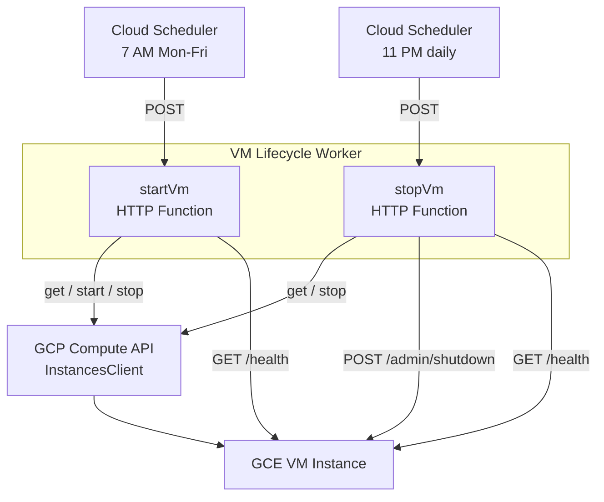
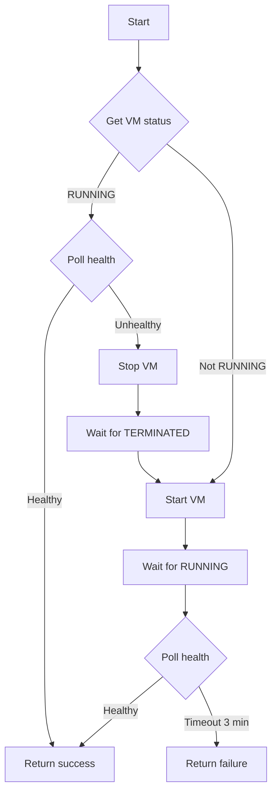
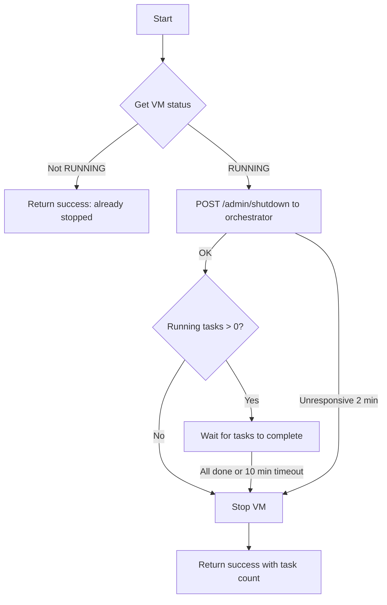

# VM Lifecycle Worker — Technical Reference

## Overview

Vm-lifecycle is a Cloud Functions (Gen2) deployment that provides two HTTP-triggered functions for starting and stopping a GCE VM instance. Both functions share a single codebase deployed from a single zip file. Cloud Scheduler invokes them on a weekday schedule to automate VM uptime.

## Architecture



## Cloud Functions

### startVm

| Property | Value                                  |
| -------- | -------------------------------------- |
| Type     | HTTP (`functions.http`)                |
| Name     | `intexuraos-vm-start-{env}`            |
| Memory   | 256 MB                                 |
| Timeout  | 120 seconds                            |
| Auth     | Cloud Scheduler service account (OIDC) |

### stopVm

| Property | Value                                  |
| -------- | -------------------------------------- |
| Type     | HTTP (`functions.http`)                |
| Name     | `intexuraos-vm-stop-{env}`             |
| Memory   | 256 MB                                 |
| Timeout  | 120 seconds                            |
| Auth     | Cloud Scheduler service account (OIDC) |

## API Endpoints

Both functions validate the `X-Internal-Auth` header before proceeding.

### startVm

| Method | Path | Description                        | Auth                     |
| ------ | ---- | ---------------------------------- | ------------------------ |
| POST   | `/`  | Start VM and wait for health check | `X-Internal-Auth` Bearer |

**Response (200):**

```typescript
{
  success: true;
  message: string; // "VM started and healthy" or "VM already running and healthy"
  startupDurationMs?: number; // Total time from invocation to healthy
}
```

**Response (503):**

```typescript
{
  success: false;
  message: string;          // Error description
  startupDurationMs?: number;
}
```

### stopVm

| Method | Path | Description                             | Auth                     |
| ------ | ---- | --------------------------------------- | ------------------------ |
| POST   | `/`  | Gracefully stop VM after tasks complete | `X-Internal-Auth` Bearer |

**Response (200):**

```typescript
{
  success: true;
  message: string;                // "VM shutdown initiated" or "VM already in X state"
  runningTasksAtShutdown?: number; // Tasks that were running when shutdown started
}
```

**Response (503):**

```typescript
{
  success: false;
  message: string;
}
```

## Startup Flow



**VM state polling details:**

The function polls the Compute API waiting for the VM to reach `RUNNING` or `TERMINATED` states after issuing start/stop commands.

| Parameter     | Value                                             |
| ------------- | ------------------------------------------------- |
| Poll interval | 5 seconds (hardcoded, separate from health check) |
| Poll timeout  | 3 minutes (shares `HEALTH_POLL_TIMEOUT_MS`)       |
| On timeout    | Throws an error caught by the outer try/catch     |

**Health polling details:**

| Parameter         | Value                                       |
| ----------------- | ------------------------------------------- |
| Health endpoint   | Configurable via `INTEXURAOS_VM_HEALTH_URL` |
| Default URL       | `https://cc-vm.intexuraos.cloud/health`     |
| Expected response | `{ "status": "ready" }`                     |
| Poll interval     | 10 seconds (from `HEALTH_POLL_INTERVAL_MS`) |
| Poll timeout      | 3 minutes (from `HEALTH_POLL_TIMEOUT_MS`)   |
| Request timeout   | 5 seconds per attempt                       |

## Shutdown Flow



**Shutdown timing details:**

| Parameter                         | Value                                           |
| --------------------------------- | ----------------------------------------------- |
| Shutdown endpoint                 | Configurable via `INTEXURAOS_VM_SHUTDOWN_URL`   |
| Default URL                       | `https://cc-vm.intexuraos.cloud/admin/shutdown` |
| Orchestrator unresponsive timeout | 2 minutes                                       |
| Grace period for running tasks    | 10 minutes                                      |
| Grace period poll interval        | 30 seconds                                      |

**Task completion polling:**

The function polls the health endpoint during the grace period. It stops waiting when:

- `data.running === 0` (all tasks finished)
- `data.status === 'shutting_down'` (orchestrator is shutting down)
- The health endpoint stops responding (orchestrator already down)
- The 10-minute grace period expires

## Domain Models

### StartVmResult

| Field               | Type    | Description                        |
| ------------------- | ------- | ---------------------------------- |
| `success`           | boolean | Whether startup completed          |
| `message`           | string  | Human-readable result or error     |
| `startupDurationMs` | number  | Time from invocation to completion |

### StopVmResult

| Field                    | Type    | Description                         |
| ------------------------ | ------- | ----------------------------------- |
| `success`                | boolean | Whether shutdown initiated          |
| `message`                | string  | Human-readable result or error      |
| `runningTasksAtShutdown` | number  | Tasks running when shutdown started |

### VM_CONFIG

| Field                                  | Type   | Default                                         |
| -------------------------------------- | ------ | ----------------------------------------------- |
| `PROJECT_ID`                           | string | `intexuraos`                                    |
| `ZONE`                                 | string | `europe-central2-a`                             |
| `INSTANCE_NAME`                        | string | `cc-vm`                                         |
| `HEALTH_ENDPOINT`                      | string | `https://cc-vm.intexuraos.cloud/health`         |
| `SHUTDOWN_ENDPOINT`                    | string | `https://cc-vm.intexuraos.cloud/admin/shutdown` |
| `HEALTH_POLL_INTERVAL_MS`              | number | `10000` (10 seconds)                            |
| `HEALTH_POLL_TIMEOUT_MS`               | number | `180000` (3 minutes)                            |
| `SHUTDOWN_GRACE_PERIOD_MS`             | number | `600000` (10 minutes)                           |
| `SHUTDOWN_POLL_INTERVAL_MS`            | number | `30000` (30 seconds)                            |
| `ORCHESTRATOR_UNRESPONSIVE_TIMEOUT_MS` | number | `120000` (2 minutes)                            |

## Changes Since v3.8.0

The legacy per-worker `workers/vm-lifecycle/cloudbuild.yaml` deployment entry was removed as part of runtime-configuration migration. The `startVm` and `stopVm` source handlers are unchanged in this release window. This worker is separate from the guarded orchestrator restart and DEV hibernation procedures; those procedures must not be inferred from its running-task poll.

## Recent Changes

| Commit     | Description                                                 | Date       |
| ---------- | ----------------------------------------------------------- | ---------- |
| `626cac13` | Add stop-vm test coverage for health throw and grace expiry | 2026-03-30 |
| `549c9698` | Improve v8 ignore annotation with specific blocker reason   | 2026-03-24 |
| `44ea683a` | Release v3.2.0 (version bump only)                          | 2026-03-07 |
| `6ba7ba00` | Fix test type errors from tsconfig check expansion          | 2026-03-03 |
| `b3f34d85` | Release v3.1.0                                              | 2026-02-22 |
| `c8a42105` | Release v3.0.0                                              | 2026-02-19 |
| `b82522d2` | Fix Cloud Functions deployment with esbuild bundling        | 2026-02-01 |
| `f10ebdbf` | Fix empty error objects in log output (INT-464)             | 2026-02-01 |
| `5aa3e1bd` | Enable strict 100% coverage enforcement (INT-427)           | 2026-01-29 |
| `7a90db67` | Fix vitest v4 migration and improve branch coverage         | 2026-01-28 |
| `cd70bc3f` | Add Cloud Functions for VM lifecycle (INT-369/370)          | 2026-01-25 |

## Dependencies

| Service              | Purpose                               |
| -------------------- | ------------------------------------- |
| GCP Compute API      | VM instance get, start, stop          |
| Orchestrator (on VM) | Shutdown notification and task status |
| Health endpoint (VM) | Application readiness verification    |

## Configuration

| Environment Variable             | Required | Default                                         | Description                |
| -------------------------------- | -------- | ----------------------------------------------- | -------------------------- |
| `INTEXURAOS_INTERNAL_AUTH_TOKEN` | Yes      | —                                               | Internal auth Bearer token |
| `INTEXURAOS_GCP_PROJECT_ID`      | No       | `intexuraos`                                    | GCP project ID             |
| `INTEXURAOS_VM_ZONE`             | No       | `europe-central2-a`                             | GCE zone                   |
| `INTEXURAOS_VM_INSTANCE_NAME`    | No       | `cc-vm`                                         | VM instance name           |
| `INTEXURAOS_VM_HEALTH_URL`       | No       | `https://cc-vm.intexuraos.cloud/health`         | Health check URL           |
| `INTEXURAOS_VM_SHUTDOWN_URL`     | No       | `https://cc-vm.intexuraos.cloud/admin/shutdown` | Shutdown endpoint URL      |
| `LOG_LEVEL`                      | No       | `info`                                          | Pino log level             |

## Infrastructure

| Resource               | Type            | Value                          |
| ---------------------- | --------------- | ------------------------------ |
| Cloud Function (start) | Gen2 HTTP       | `intexuraos-vm-start-{env}`    |
| Cloud Function (stop)  | Gen2 HTTP       | `intexuraos-vm-stop-{env}`     |
| Entry points           | —               | `startVm`, `stopVm`            |
| Runtime                | —               | Node.js 22                     |
| Memory (each)          | —               | 256 MB                         |
| Timeout (each)         | —               | 120 seconds                    |
| Scheduler (start)      | Cloud Scheduler | `0 7 * * 1-5` (Europe/Warsaw)  |
| Scheduler (stop)       | Cloud Scheduler | `0 23 * * *` (Europe/Warsaw)   |
| Service account        | —               | `intexuraos-functions-{env}`   |
| Source bucket object   | —               | `vm-lifecycle/function.zip`    |
| Scheduler retry        | —               | 3 retries, 5–30s backoff       |

## Gotchas

**Shared zip, separate functions** — Both `startVm` and `stopVm` deploy from the same `function.zip` but register as separate Cloud Functions with different entry points. Updating one redeploys both.

**Timeout budget mismatch** — The 120-second Cloud Function timeout is shorter than the 3-minute health poll timeout. Slow boots can cause the function to timeout before the health check passes. The health poll continues internally until the function runtime is killed.

**Orchestrator optional** — If the orchestrator's shutdown endpoint is unreachable, the stop function waits 2 minutes then proceeds with forced shutdown. This prevents blocking VM shutdown on an unresponsive application.

**esbuild bundling required** — Workers use `build-service.mjs` with esbuild instead of plain `tsc`. This bundles `@intexuraos/*` workspace packages into the output zip. Cloud Functions npm runtime cannot resolve `workspace:*` references, so plain TypeScript compilation breaks deployment.

**Auth header format** — The function expects `X-Internal-Auth: Bearer <token>`, not the standard `Authorization` header. This matches the IntexuraOS internal auth pattern used across all services.

**State poll vs health poll** — The `waitForState` function uses a hardcoded 5-second poll interval, separate from the `HEALTH_POLL_INTERVAL_MS` config (10 seconds). These two polling loops serve different purposes: state polling checks the Compute API for VM status transitions; health polling checks the application HTTP endpoint for readiness.

## File Structure

```
workers/vm-lifecycle/src/
  index.ts         - HTTP function handlers, auth validation, registers startVm and stopVm
  start-vm.ts      - VM startup logic with health polling
  stop-vm.ts       - Graceful shutdown with task completion wait
  config.ts        - VM configuration constants and env var defaults
  logger.ts        - Pino logger with error serialization
  __tests__/
    index.test.ts      - Auth and HTTP method validation tests
    start-vm.test.ts   - Start flow tests (running, stopped, unhealthy, errors)
    stop-vm.test.ts    - Stop flow tests (tasks, orchestrator, errors)
    config.test.ts     - Config defaults and env var override tests
    logger.test.ts     - Logger initialization tests
```
