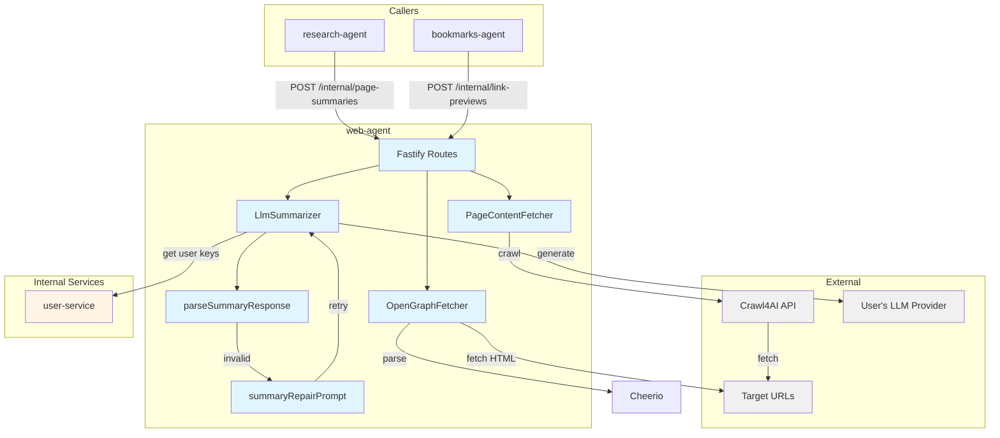
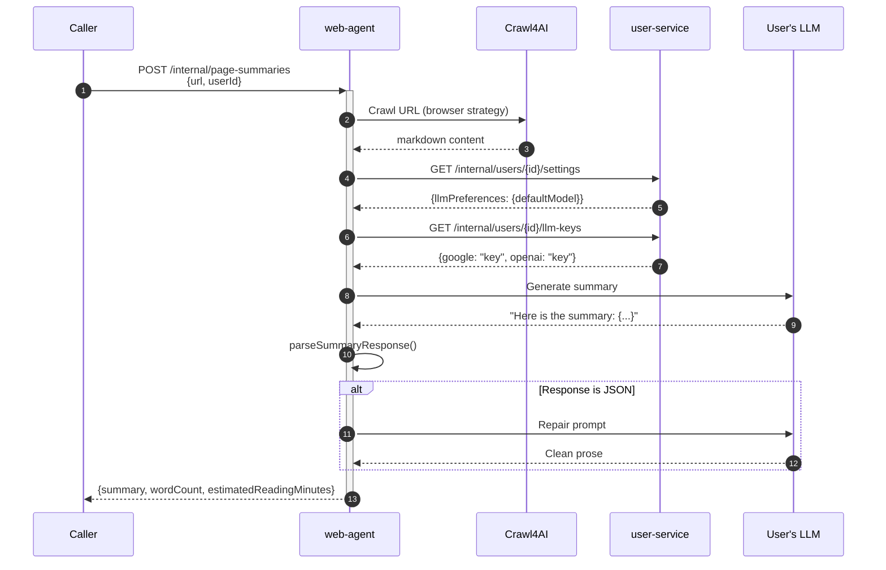

# Web Agent - Technical Reference

## Overview

Web-agent extracts web content and generates AI summaries. It uses Crawl4AI for headless browser crawling, Cheerio for OpenGraph parsing, and the user's configured LLM for summarization with automatic response repair.

Runs on Cloud Run with auto-scaling (0-1 instances).

## Architecture



## Data Flow - Page Summarization



## Recent Changes

| Commit     | Description                                             | Date       |
| ---------- | ------------------------------------------------------- | ---------- |
| `b1c7a4bb` | INT-269 Migrate to @intexuraos/internal-clients package | 2026-01-25 |
| `4cc3276f` | INT-213 Fix AI summary returning raw JSON               | 2026-01-24 |
| `31dbd6d0` | Handle 403 errors on OpenGraph link preview fetching    | 2026-01-21 |
| `8e006901` | INT-193 Migrate Crawl4AI client to api.crawl4ai.com/v1  | 2026-01-20 |
| `5b589289` | INT-128 Add page summarization via Crawl4AI             | 2026-01-18 |

## API Endpoints

### Internal Endpoints

| Method | Path                       | Description                                  | Auth           |
| ------ | -------------------------- | -------------------------------------------- | -------------- |
| POST   | `/internal/link-previews`  | Fetch OpenGraph metadata for URLs            | Internal token |
| POST   | `/internal/page-summaries` | Crawl and summarize a web page with user LLM | Internal token |

### Link Previews Request

```typescript
interface FetchLinkPreviewsBody {
  urls: string[]; // 1-10 URLs
  timeoutMs?: number; // 1000-30000ms (default: 5000)
}
```

### Link Previews Response

```typescript
interface FetchLinkPreviewsResponse {
  results: LinkPreviewResult[];
  metadata: {
    requestedCount: number;
    successCount: number;
    failedCount: number;
    durationMs: number;
  };
}
```

### Page Summaries Request

```typescript
interface SummarizePageBody {
  url: string; // URL to summarize
  userId: string; // User ID for LLM key lookup
  maxSentences?: number; // 1-50 (default: 20)
  maxReadingMinutes?: number; // 1-10 (default: 3)
}
```

### Page Summaries Response

```typescript
interface SummarizePageResponse {
  result: PageSummaryResult;
  metadata: {
    durationMs: number;
  };
}

interface PageSummary {
  url: string;
  summary: string;
  wordCount: number;
  estimatedReadingMinutes: number;
}
```

## Domain Models

### LinkPreview

| Field | Type | Description |
| ------------- | ---------- | ------------ | |
| `url` | `string` | Original URL |
| `title` | `string \  | undefined` | og:title or HTML title |
| `description` | `string \  | undefined` | og:description or meta desc |
| `image` | `string \  | undefined` | Resolved absolute og:image |
| `favicon` | `string \  | undefined` | Favicon URL |
| `siteName` | `string \  | undefined` | og:site_name |

### LinkPreviewError

| Code            | Meaning                                |
| --------------- | -------------------------------------- |
| `FETCH_FAILED`  | HTTP errors or network issues          |
| `TIMEOUT`       | Request exceeded timeout               |
| `TOO_LARGE`     | Response over 2MB                      |
| `INVALID_URL`   | Malformed URL or unsupported protocol  |
| `ACCESS_DENIED` | HTTP 403 - website blocked the request |

### PageSummaryError

| Code           | Meaning                               |
| -------------- | ------------------------------------- |
| `FETCH_FAILED` | Crawl4AI failed to fetch page         |
| `TIMEOUT`      | Crawl exceeded 60s timeout            |
| `NO_CONTENT`   | No markdown extracted from page       |
| `API_ERROR`    | LLM API error or user service error   |
| `INVALID_URL`  | Malformed URL or unsupported protocol |

## Key Components

### PageContentFetcher

Crawls pages via Crawl4AI Cloud API without LLM extraction.

**Configuration:**

| Setting     | Default                    | Description             |
| ----------- | -------------------------- | ----------------------- |
| `baseUrl`   | `https://api.crawl4ai.com` | Crawl4AI Cloud endpoint |
| `timeoutMs` | 60000                      | Crawl timeout           |
| `apiKey`    | (required)                 | Crawl4AI API key        |

**Strategy:** Uses `browser` strategy for JavaScript rendering.

### LlmSummarizer

Generates prose summaries with automatic repair on parse failures.

**Flow:**

1. Build prompt with language preservation instruction
2. Send to user's LLM via `llm-factory`
3. Parse response with `parseSummaryResponse()`
4. If JSON detected, send repair prompt and retry once
5. Return `PageSummary` or error

**Key feature:** Prompt includes "Write in SAME LANGUAGE as original content" instruction.

### parseSummaryResponse

Validates LLM output is clean prose.

**Checks:**

- Not empty after cleaning
- Not JSON format (objects/arrays)
- Strips unwanted prefixes ("Here is", "Summary:", etc.)
- Strips markdown code blocks

**Returns:** `{ summary: string, wordCount: number }` or `ParseError`

### OpenGraphFetcher

Fetches and parses OpenGraph metadata.

**Browser-like headers:**

```typescript
{
  'User-Agent': 'Mozilla/5.0 (Windows NT 10.0; Win64; x64) AppleWebKit/537.36 (KHTML, like Gecko) Chrome/130.0.0.0 Safari/537.36',
  'Accept': 'text/html,application/xhtml+xml,application/xml;q=0.9,image/avif,image/webp,*/*;q=0.8',
  'Accept-Language': 'en-US,en;q=0.9',
  'Sec-Fetch-Dest': 'document',
  'Sec-Fetch-Mode': 'navigate',
  'Sec-Fetch-Site': 'none',
  'Sec-Fetch-User': '?1',
}
```

**Configuration:**

| Setting           | Default       | Description           |
| ----------------- | ------------- | --------------------- |
| `timeoutMs`       | 5000          | Request timeout       |
| `maxResponseSize` | 2097152 (2MB) | Maximum response size |

## Dependencies

### External Services

| Service    | Purpose            | Failure Mode        |
| ---------- | ------------------ | ------------------- |
| Crawl4AI   | Web page crawling  | Return FETCH_FAILED |
| User's LLM | Summary generation | Return API_ERROR    |

### Internal Services

| Service      | Endpoint                        | Purpose                    |
| ------------ | ------------------------------- | -------------------------- |
| user-service | `/internal/users/{id}/settings` | Get default LLM model      |
| user-service | `/internal/users/{id}/llm-keys` | Get encrypted LLM API keys |

**Integration Note (v2.1.0):** web-agent uses `@intexuraos/internal-clients/user-service` for type-safe, validated communication with user-service. This package provides:

- `createUserServiceClient()` - Factory for configured client
- `UserServiceClient` interface with `getLlmClient()` method
- Automatic error handling and result types

## Configuration

| Variable                              | Purpose                | Required |
| ------------------------------------- | ---------------------- | -------- |
| `INTEXURAOS_INTERNAL_AUTH_TOKEN`      | Internal service auth  | Yes      |
| `INTEXURAOS_CRAWL4AI_API_KEY`         | Crawl4AI Cloud API key | Yes      |
| `INTEXURAOS_SENTRY_DSN`               | Error tracking         | Yes      |
| `INTEXURAOS_USER_SERVICE_URL`         | User service base URL  | No\*     |
| `INTEXURAOS_APP_SETTINGS_SERVICE_URL` | Pricing lookup         | No\*     |

\*Has localhost defaults for development

## Gotchas

**Crawl vs Summary separation** - PageContentFetcher only crawls; LlmSummarizer handles AI. This allows using user's LLM keys rather than shared infrastructure.

**Repair mechanism** - If LLM returns JSON, parser detects it and triggers repair prompt automatically. Only retries once.

**Language preservation** - Summary prompt explicitly instructs "Write in SAME LANGUAGE as original content" to prevent English summaries of non-English articles.

**403 handling** - Returns `ACCESS_DENIED` error code specifically for 403 responses, distinct from general `FETCH_FAILED`.

**Browser-like headers** - OpenGraphFetcher sends Chrome-like headers including Sec-Fetch-\* to bypass basic bot detection.

**User LLM client** - Summaries use user's API key from user-service, not a shared key. Pricing tracked per-user.

**Empty response handling** - `nonEmpty()` helper treats empty strings same as undefined for fallback logic.

**Concurrent link previews** - All URLs fetched in parallel via Promise.all. One timeout doesn't affect others.

## File Structure

```
apps/web-agent/src/
  domain/
    linkpreview/
      models/
        LinkPreview.ts           # LinkPreview, LinkPreviewError types
      ports/
        linkPreviewFetcher.ts    # Fetcher interface
    pagesummary/
      models/
        PageSummary.ts           # PageSummary, PageSummaryError types
      ports/
        pageSummaryService.ts    # Service interface
  infra/
    linkpreview/
      openGraphFetcher.ts        # Cheerio-based OG extraction
    pagesummary/
      pageContentFetcher.ts      # Crawl4AI client (crawl only)
      llmSummarizer.ts           # User's LLM summarization
      crawl4aiClient.ts          # Legacy combined client (deprecated)
      parseSummaryResponse.ts    # Response validation
      buildSummaryRepairPrompt.ts # Prompt builders
    user/
      index.ts                   # Re-exports from @intexuraos/internal-clients
  routes/
    internalRoutes.ts            # /internal/* endpoints
    schemas/
      linkPreviewSchemas.ts      # Request/response schemas
      pageSummarySchemas.ts      # Request/response schemas
  services.ts                    # DI container
  server.ts                      # Fastify server
  index.ts                       # Entry point
```

**Package Dependencies (v2.1.0):**

- `@intexuraos/internal-clients` - Type-safe clients for internal services
- `@intexuraos/llm-pricing` - Pricing context for LLM cost tracking
- `@intexuraos/llm-factory` - User's LLM client generation
