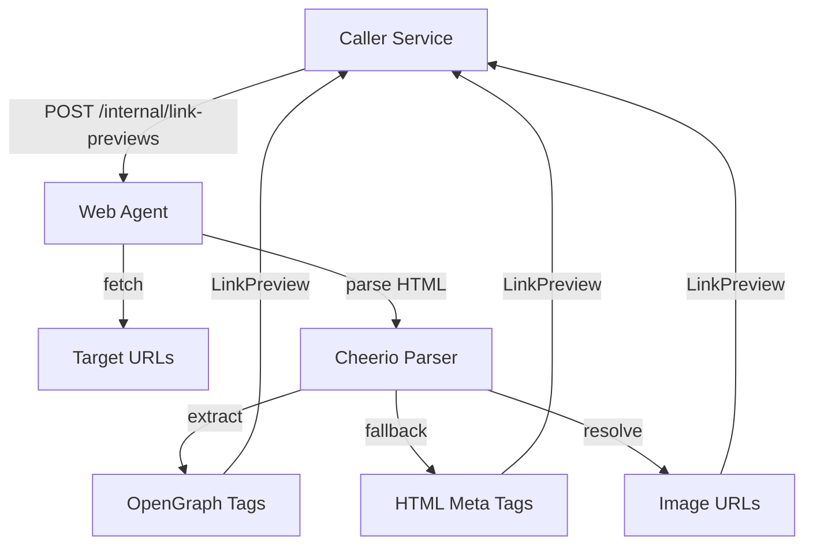
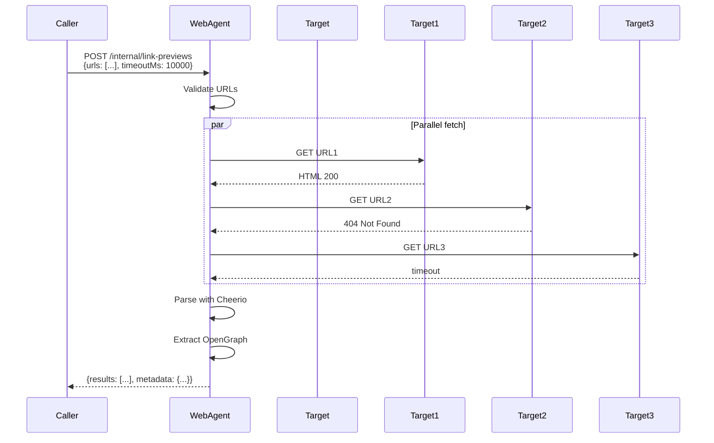

# Web Agent - Technical Reference

## Overview

Web-agent is an internal-only service that fetches OpenGraph metadata from URLs. It uses Cheerio for HTML parsing and native fetch with AbortController for timeout handling.

## Architecture



## API Endpoints

### Internal Endpoints

| Method | Path                      | Description                       | Auth           |
| ------ | ------------------------- | --------------------------------- | -------------- |
| POST   | `/internal/link-previews` | Fetch OpenGraph metadata for URLs | Internal token |

**Request Body:**

```typescript
{
  urls: string[],          // URLs to fetch
  timeoutMs?: number       // Optional timeout override (default 5000)
}
```

**Response:**

```typescript
{
  results: LinkPreviewResult[],  // Individual result per URL
  metadata: {
    requestedCount: number,
    successCount: number,
    failedCount: number,
    durationMs: number
  }
}
```

## Domain Models

### LinkPreview

| Field | Type | Description |
| ------------- | --------- | ------------ | |
| `url` | string | Original URL |
| `title` | string \ | undefined | og:title or HTML title |
| `description` | string \ | undefined | og:description or meta description |
| `image` | string \ | undefined | Resolved absolute og:image URL |
| `favicon` | string \ | undefined | Favicon URL |
| `siteName` | string \ | undefined | og:site_name |

### LinkPreviewResult (discriminated union)

**Success:**

| Field     | Type        | Description        |
| --------- | ----------- | ------------------ |
| `url`     | string      | Original URL       |
| `status`  | 'success'   | Result status      |
| `preview` | LinkPreview | Extracted metadata |

**Failed:**

| Field    | Type             | Description   |
| -------- | ---------------- | ------------- |
| `url`    | string           | Original URL  |
| `status` | 'failed'         | Result status |
| `error`  | LinkPreviewError | Error details |

### LinkPreviewError

| Field     | Type                 | Description                                   |
| --------- | -------------------- | --------------------------------------------- |
| `code`    | LinkPreviewErrorCode | FETCH_FAILED, TIMEOUT, TOO_LARGE, INVALID_URL |
| `message` | string               | Human-readable error message                  |

## OpenGraph Tag Extraction

| Tag         | Property           | Fallback                    |
| ----------- | ------------------ | --------------------------- |
| Title       | `og:title`         | `<title>` text              |
| Description | `og:description`   | `<meta name="description">` |
| Image       | `og:image`         | None                        |
| Site Name   | `og:site_name`     | None                        |
| Favicon     | `link[rel="icon"]` | `/favicon.ico`              |

**Favicon selectors in order:**

1. `link[rel="icon"]`
2. `link[rel="shortcut icon"]`
3. `link[rel="apple-touch-icon"]`
4. `link[rel="apple-touch-icon-precomposed"]`
5. `{origin}/favicon.ico`

## Configuration

| Setting           | Default        | Description                     |
| ----------------- | -------------- | ------------------------------- |
| `timeoutMs`       | 5000           | Request timeout in milliseconds |
| `maxResponseSize` | 2097152 (2MB)  | Maximum response body size      |
| `userAgent`       | Mozilla/5.0... | User agent string               |

## Dependencies

**Packages:**

- `cheerio` - HTML parsing
- Native `fetch` - HTTP requests
- `AbortController` - Timeout handling

**No external service dependencies.**
**No database dependencies.**

## Gotchas

**Relative URL resolution** - Image paths resolved relative to target URL, not web-agent. `new URL(imagePath, targetUrl)` handles this.

**Content-Length check** - If header present, checked before download. If absent, streams with 2MB cap.

**Stream chunking** - Response read in chunks to enforce size limit mid-download.

**Promise.all** - All URLs fetched in parallel. One timeout doesn't affect others.

**Empty values omitted** - Missing title/description not included in response (undefined, not empty string).

**User-Agent** - Custom IntexuraOSBot UA for identification and potential blocking.

**Redirect following** - `redirect: 'follow'` automatically follows redirects (max 20 by spec).

**TextDecoder** - Uses UTF-8 default. May fail on non-UTF8 pages (returns FETCH_FAILED).

**Concurrent requests** - No internal rate limiting. Caller must implement throttling.

## File Structure

```
apps/web-agent/src/
  domain/
    linkpreview/
      models/
        LinkPreview.ts       # Domain models
      ports/
        linkPreviewFetcher.ts # Fetcher interface
  infra/
    linkpreview/
      openGraphFetcher.ts    # Cheerio implementation
  routes/
    internalRoutes.ts        # POST /internal/link-previews
    schemas/
      linkPreviewSchemas.ts  # Zod validation schemas
  services.ts                # DI container
  server.ts                  # Fastify server
```

## HTTP Flow


