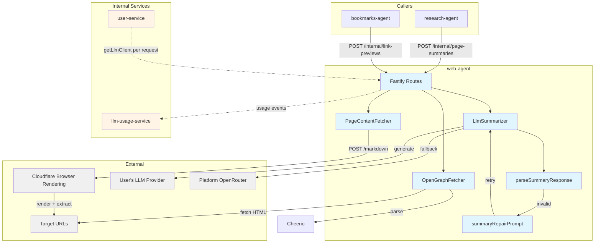
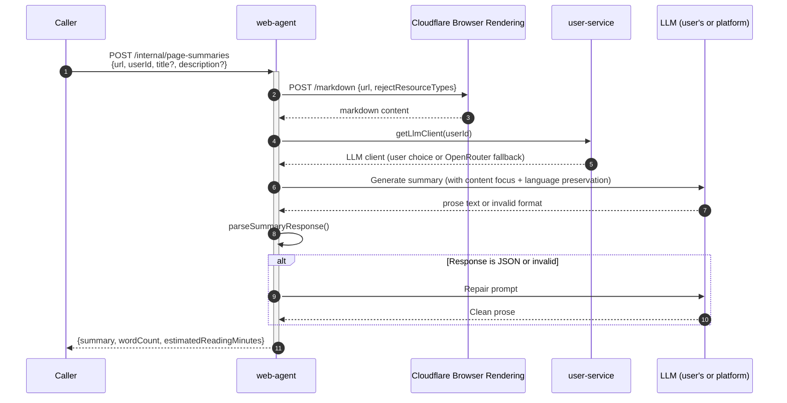

# Web Agent — Technical Reference

## Overview

Web Agent extracts web content and generates AI summaries. It uses Cloudflare Browser Rendering for headless browser content extraction (returning Markdown), Cheerio for OpenGraph parsing, and an LLM resolved through user-service with a platform OpenRouter fallback.

Runs on Cloud Run with auto-scaling (0–1 instances). Port 8127 on dev (PM2).

## Architecture


```mermaid
graph TB
    subgraph "Callers"
        RA[research-agent]
        BA[bookmarks-agent]
    end

    subgraph "web-agent"
        Routes[Fastify Routes]
        PCF[PageContentFetcher]
        LLM[LlmSummarizer]
        OGF[OpenGraphFetcher]
        Parser[parseSummaryResponse]
        Repair[summaryRepairPrompt]
    end

    subgraph "External"
        CF[Cloudflare Browser Rendering]
        UserLLM[User's LLM Provider]
        PlatformLLM[Platform OpenRouter]
        Target[Target URLs]
    end

    subgraph "Internal Services"
        US[user-service]
        Usage[llm-usage-service]
    end

    RA -->|POST /internal/page-summaries| Routes
    BA -->|POST /internal/link-previews| Routes

    Routes --> PCF
    Routes --> OGF

    PCF -->|POST /markdown| CF
    CF -->|render + extract| Target

    Routes --> LLM
    LLM -->|generate| UserLLM
    LLM -->|fallback| PlatformLLM
    LLM --> Parser
    Parser -->|invalid| Repair
    Repair -->|retry| LLM

    OGF -->|fetch HTML| Target
    OGF -->|parse| Cheerio[Cheerio]

    US -.->|getLlmClient per request| Routes
    Routes -.->|usage events| Usage

    classDef service fill:#e1f5ff
    classDef external fill:#f0f0f0
    classDef internal fill:#fff4e6

    class Routes,PCF,LLM,OGF,Parser,Repair service
    class CF,UserLLM,PlatformLLM,Target external
    class US,Usage internal
```

## Data Flow — Page Summarization


```mermaid
sequenceDiagram
    autonumber
    participant Caller
    participant WebAgent as web-agent
    participant Cloudflare as Cloudflare Browser Rendering
    participant UserService as user-service
    participant LLM as LLM (user's or platform)

    Caller->>+WebAgent: POST /internal/page-summaries<br/>{url, userId, title?, description?}
    WebAgent->>Cloudflare: POST /markdown {url, rejectResourceTypes}
    Cloudflare-->>WebAgent: markdown content
    WebAgent->>UserService: getLlmClient(userId)
    UserService-->>WebAgent: LLM client (user choice or OpenRouter fallback)
    WebAgent->>LLM: Generate summary (with content focus + language preservation)
    LLM-->>WebAgent: prose text or invalid format
    WebAgent->>WebAgent: parseSummaryResponse()
    alt Response is JSON or invalid
        WebAgent->>LLM: Repair prompt
        LLM-->>WebAgent: Clean prose
    end
    WebAgent-->>-Caller: {summary, wordCount, estimatedReadingMinutes}
```

## Recent Changes

### Changes since v3.8.0

The platform OpenRouter credential is now required at startup and passed to `createUserServiceClient()` as `platformOpenRouterApiKey`. This completes the configured fallback path for page summaries; link preview and page-summary endpoints retain their existing contracts.

| Commit     | Description                                                            | Date       |
| ---------- | ---------------------------------------------------------------------- | ---------- |
| `20aa37c4` | Fix page summary prompt review findings                                | 2026-04-02 |
| `af79b3ea` | Improve page summary prompt focus (INT-1206)                           | 2026-04-02 |
| `9755f9d4` | Address PR review comments for INT-1153                                | 2026-03-29 |
| `dc4b3e98` | Extract constants and remove redundant logging                         | 2026-03-29 |
| `cf614640` | Replace Crawl4AI with Cloudflare Browser Rendering markdown client     | 2026-03-29 |
| `287db2b6` | Add getUserTimezone to UserServiceClient                               | 2026-03-27 |
| `e6896a97` | Downgrade expected operational warnings from warn to info level        | 2026-03-27 |
| `549c9698` | Enforce strict v8 ignore validation with blocker keyword checks        | 2026-03-24 |

## API Endpoints

### Internal Endpoints

| Method | Path                       | Description                                  | Auth           |
| ------ | -------------------------- | -------------------------------------------- | -------------- |
| POST   | `/internal/link-previews`  | Fetch OpenGraph metadata for URLs            | Internal token |
| POST   | `/internal/page-summaries` | Crawl and summarize a web page with user LLM | Internal token |

### System Endpoints

| Method | Path            | Description         | Auth |
| ------ | --------------- | ------------------- | ---- |
| GET    | `/health`       | Health check        | None |
| GET    | `/docs`         | Swagger UI          | None |
| GET    | `/openapi.json` | OpenAPI spec (JSON) | None |

### Link Previews Request

```typescript
interface FetchLinkPreviewsBody {
  urls: string[]; // 1-10 URLs
  timeoutMs?: number; // 1000-30000ms (default: 5000)
}
```

### Link Previews Response

```typescript
interface FetchLinkPreviewsResponse {
  results: LinkPreviewResult[];
  metadata: {
    requestedCount: number;
    successCount: number;
    failedCount: number;
    durationMs: number;
  };
}
```

### Page Summaries Request

```typescript
interface SummarizePageBody {
  url: string; // URL to summarize
  userId: string; // User ID for LLM key lookup
  title?: string; // Optional title hint from metadata
  description?: string; // Optional description hint from metadata
  maxSentences?: number; // 1-50 (default: 20)
  maxReadingMinutes?: number; // 1-10 (default: 3)
}
```

### Page Summaries Response

```typescript
interface SummarizePageResponse {
  result: PageSummaryResult;
  metadata: {
    durationMs: number;
  };
}

interface PageSummary {
  url: string;
  summary: string;
  wordCount: number;
  estimatedReadingMinutes: number;
}
```

## Domain Models

### LinkPreview

| Field         | Type                  | Description                    |
| ------------- | --------------------- | ------------------------------ |
| `url`         | `string`              | Original URL                   |
| `title`       | `string \             | undefined`                     | og:title or HTML title |
| `description` | `string \             | undefined`                     | og:description or meta desc |
| `image`       | `string \             | undefined`                     | Resolved absolute og:image URL |
| `favicon`     | `string \             | undefined`                     | Favicon URL |
| `siteName`    | `string \             | undefined`                     | og:site_name |

### LinkPreviewError

| Code            | Meaning                                |
| --------------- | -------------------------------------- |
| `FETCH_FAILED`  | HTTP errors or network issues          |
| `TIMEOUT`       | Request exceeded timeout               |
| `TOO_LARGE`     | Response over 2 MB                     |
| `INVALID_URL`   | Malformed URL or unsupported protocol  |
| `ACCESS_DENIED` | HTTP 403 — website blocked the request |

### PageSummaryError

| Code           | Meaning                                           |
| -------------- | ------------------------------------------------- |
| `FETCH_FAILED` | Cloudflare Browser Rendering failed to fetch page |
| `TIMEOUT`      | Browser rendering exceeded 60s timeout            |
| `NO_CONTENT`   | No markdown extracted from page                   |
| `API_ERROR`    | LLM API error or user service error               |
| `INVALID_URL`  | Malformed URL or unsupported protocol             |
| `TOO_LARGE`    | Response exceeds size limit                       |
| `RATE_LIMITED` | Cloudflare returned HTTP 429                      |

## Key Components

### PageContentFetcher (Cloudflare Browser Rendering)

Extracts page content via Cloudflare Browser Rendering `/markdown` endpoint. Sends a POST request with the target URL and rejected resource types (images, media, fonts, stylesheets). Returns clean Markdown text.

**Configuration:**

| Setting     | Default                      | Description             |
| ----------- | ---------------------------- | ----------------------- |
| `baseUrl`   | `https://api.cloudflare.com` | Cloudflare API endpoint |
| `accountId` | (required)                   | Cloudflare account ID   |
| `apiToken`  | (required)                   | Cloudflare API token    |
| `timeoutMs` | 60000                        | Request timeout         |

**Strategy:** Uses Cloudflare's headless browser to render JavaScript, then extracts page content as Markdown. The `rejectResourceTypes` parameter filters out images, media, fonts, and stylesheets to reduce processing time and return text-only content.

### LlmSummarizer

Generates prose summaries with automatic repair on parse failures.

**Flow:**

1. Build prompt with language preservation, content focus, and main content selection instructions
2. Send to the client resolved by user-service (platform OpenRouter fallback)
3. Parse response with `parseSummaryResponse()`
4. If JSON or invalid format detected, send repair prompt and retry once
5. Return `PageSummary` or error

**Key features:**

- Prompt includes "Write in SAME LANGUAGE as original content" instruction
- Content focus section guides LLM to summarize actual page content, not platform descriptions (INT-533)
- Main content selection uses URL, title, and description hints to identify the primary content block and skip site chrome (INT-1206)
- Both `summaryPrompt` and `summaryRepairPrompt` implement `PromptBuilder` with `version: '2.0.0'`

### parseSummaryResponse

Validates LLM output is clean prose.

**Checks:**

- Not empty after cleaning
- Not JSON format (objects/arrays)
- Strips unwanted prefixes ("Here is", "Summary:", etc.)
- Strips markdown code blocks

**Returns:** `{ summary: string, wordCount: number }` or `ParseError`

### OpenGraphFetcher

Fetches and parses OpenGraph metadata via direct HTTP with browser-like headers.

**Browser-like headers:**

```typescript
{
  'User-Agent': 'Mozilla/5.0 (Windows NT 10.0; Win64; x64) AppleWebKit/537.36 ...',
  'Accept': 'text/html,application/xhtml+xml,application/xml;q=0.9,...',
  'Accept-Language': 'en-US,en;q=0.9',
  'Accept-Encoding': 'gzip, deflate, br',
  'Cache-Control': 'no-cache',
  'Connection': 'keep-alive',
  'Sec-Fetch-Dest': 'document',
  'Sec-Fetch-Mode': 'navigate',
  'Sec-Fetch-Site': 'none',
  'Sec-Fetch-User': '?1',
  'Upgrade-Insecure-Requests': '1',
}
```

**Configuration:**

| Setting           | Default        | Description           |
| ----------------- | -------------- | --------------------- |
| `timeoutMs`       | 5000           | Request timeout       |
| `maxResponseSize` | 2097152 (2 MB) | Maximum response size |

## Dependencies

### External Services

| Service                      | Purpose                                          | Failure Mode        |
| ---------------------------- | ------------------------------------------------ | ------------------- |
| Cloudflare Browser Rendering | Web page content extraction (/markdown endpoint) | Return FETCH_FAILED |
| User's LLM                   | Summary generation                               | Return API_ERROR    |

### Internal Services

| Service           | Endpoint               | Purpose                                        |
| ----------------- | ---------------------- | ---------------------------------------------- |
| user-service      | `getLlmClient(userId)` | Get LLM client (user key or platform fallback) |
| llm-usage-service | usage sink             | Attribute model, token, and cost usage         |

**Integration Note:** web-agent uses `@intexuraos/internal-clients` for type-safe communication with user-service. This package provides:

- `createUserServiceClient()` — Factory for configured client
- `UserServiceClient` interface with `getLlmClient()` method
- Automatic error handling and result types
- Platform OpenRouter fallback when a user choice cannot be resolved

## Configuration

| Variable                              | Purpose                                       | Required |
| ------------------------------------- | --------------------------------------------- | -------- |
| `INTEXURAOS_INTERNAL_AUTH_TOKEN`      | Internal service auth                         | Yes      |
| `INTEXURAOS_CLOUDFLARE_ACCOUNT_ID`    | Cloudflare account ID                         | Yes      |
| `INTEXURAOS_CLOUDFLARE_API_TOKEN`     | Cloudflare API token (Browser Rendering Edit) | Yes      |
| `INTEXURAOS_USER_SERVICE_URL`         | User service base URL                         | Yes      |
| `INTEXURAOS_LLM_USAGE_SERVICE_URL`    | Pricing lookup                                | Yes      |
| `INTEXURAOS_SENTRY_DSN`               | Error tracking                                | Yes      |
| `INTEXURAOS_OPENROUTER_APP_API_KEY`   | Platform OpenRouter fallback                  | Required |

All required vars are validated at startup via `validateRequiredEnv()`. `INTEXURAOS_SENTRY_DSN` is validated separately with a direct check. The platform OpenRouter key is passed to `createUserServiceClient()` for fallback resolution.

## Gotchas

**Fetch vs Summary separation** — PageContentFetcher only fetches content via Cloudflare; LlmSummarizer handles AI. This allows using the user's LLM keys rather than shared infrastructure.

**Platform fallback chain** — When a user choice cannot be resolved, `getLlmClient()` uses the platform OpenRouter default. Direct Google model preferences are normalized to that fallback.

**Repair mechanism** — If the LLM returns JSON, the parser detects it and triggers a repair prompt automatically. Only retries once.

**Language preservation** — Summary prompt explicitly instructs "Write in SAME LANGUAGE as original content" to prevent English summaries of non-English articles.

**Content focus prompting** — Summary prompts include a CONTENT FOCUS section that prevents the LLM from describing the platform instead of the actual content (e.g., avoids "LinkedIn is a professional network" preambles).

**Main content selection** — The prompt guides the LLM to identify the primary content block using URL, title, and description hints, skipping cookie banners, navigation, login prompts, and other site chrome (INT-1206).

**403 handling** — Returns `ACCESS_DENIED` error code specifically for 403 responses, distinct from general `FETCH_FAILED`.

**Browser-like headers** — OpenGraphFetcher sends Chrome-like headers including Sec-Fetch-* to bypass basic bot detection.

**User LLM client** — Summaries use the user's API key from user-service when available; pricing is tracked per-user regardless of which key is used.

**Concurrent link previews** — All URLs fetched in parallel via Promise.all. One timeout does not affect others.

**Rate limiting (429)** — Cloudflare 429 responses return `RATE_LIMITED` error code, distinct from general `API_ERROR`.

**PromptBuilder versioning** — Both `summaryPrompt` and `summaryRepairPrompt` use the `PromptBuilder` interface with semver `version: '2.0.0'`. Bump the version when changing prompt content.

**SentryBox logging** — Uses `createAppLogger()` from `@intexuraos/infra-sentry` for automatic error forwarding to SentryBox.

**Response contract** — All internal routes use `reply.ok()` / `reply.fail()` instead of raw `reply.send()` / `reply.status()`.

**No Firestore** — This service is stateless. It does not own any Firestore collections.

**Pricing at startup** — The service fetches LLM pricing from app-settings-service at startup and passes it to the user service client for cost tracking.

**Cloudflare resource filtering** — The Cloudflare request uses `rejectResourceTypes: ['image', 'media', 'font', 'stylesheet']` to skip non-text resources, reducing page load time and focusing on content.

## File Structure

```
apps/web-agent/src/
  domain/
    linkpreview/
      models/
        LinkPreview.ts           # LinkPreview, LinkPreviewError types
      ports/
        linkPreviewFetcher.ts    # Fetcher interface
    pagesummary/
      models/
        PageSummary.ts           # PageSummary, PageSummaryError types
      ports/
        pageSummaryService.ts    # Service interface
  infra/
    linkpreview/
      openGraphFetcher.ts        # Cheerio-based OG extraction
    pagesummary/
      cloudflareMarkdownClient.ts # Cloudflare Browser Rendering client (with RATE_LIMITED handling)
      llmSummarizer.ts           # User's LLM summarization (with platform fallback)
      parseSummaryResponse.ts    # Response validation
      buildSummaryRepairPrompt.ts # PromptBuilder prompts v2.0.0 (with content focus + main content selection)
  routes/
    internalRoutes.ts            # /internal/* endpoints
    schemas/
      linkPreviewSchemas.ts      # Request/response schemas
      pageSummarySchemas.ts      # Request/response schemas
  services.ts                    # DI container
  server.ts                      # Fastify server
  index.ts                       # Entry point
```

**Package Dependencies:**

- `@intexuraos/internal-clients` — Type-safe clients for internal services (with fallback chain)
- `@intexuraos/llm-pricing` — Pricing context for LLM cost tracking
- `@intexuraos/llm-factory` — User's LLM client generation
- `@intexuraos/llm-prompts` — PromptBuilder interface with semver versioning
- `@intexuraos/llm-utils` — `createDetailedParseErrorMessage()` for structured LLM parse error context
- `cheerio` — HTML parsing for OpenGraph metadata extraction
