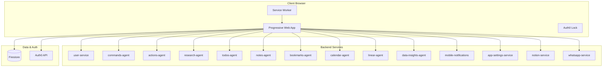

# Web App — Technical Reference

## Overview

Single-page React application built with Vite, serving as the primary user interface for IntexuraOS. Uses Auth0 for authentication, Firestore for real-time data synchronization, and connects to 13+ backend microservices via REST APIs. Deploys as a Progressive Web App (PWA) to Google Cloud Storage behind a load balancer.

## Architecture



## Recent Changes

| Commit     | Description                                                                               | Date       |
| ---------- | ----------------------------------------------------------------------------------------- | ---------- |
| `31ab6d2f` | INT-270: Remove system health page from UI                                                | 2025-01-14 |
| `77c8b30d` | Update Intelligence as Infrastructure section                                             | 2025-01-10 |
| `9d85352a` | Update README, HomePage, and docs for v2.0.0 release                                      | 2025-01-10 |
| `4fa0fed3` | Release v2.0.0                                                                            | 2025-01-10 |
| `f7a21a27` | INT-243: Apply E2_MEDIUM machine type to all app cloudbuild configs                       | 2025-01-08 |
| `575379e8` | Fix PR review findings from INT-208 and INT-203                                           | 2025-01-07 |
| `8f464331` | Improve WhatsApp voice message transcription UI (INT-205)                                 | 2025-01-07 |
| `a23ed1ef` | Redesign Linear board column layout (INT-208)                                             | 2025-01-07 |
| `089fbe51` | Fix inbox showing old actions after initial load                                          | 2025-01-03 |
| `60bb9396` | Add calendar preview Pub/Sub infrastructure, web UI, and execution optimization (INT-189) | 2024-12-20 |

## Application Structure

```
apps/web/src/
├── components/         # Reusable UI components
│   ├── ui/             # Base UI components (Button, Card, Input)
│   ├── ActionItem.tsx  # Single action display with buttons
│   ├── Layout.tsx      # Main app layout with sidebar
│   ├── Header.tsx      # Top navigation bar
│   └── ...
├── context/            # React context providers
│   ├── AuthContext.tsx # Auth0 authentication wrapper
│   ├── SyncQueueContext.tsx # Offline sync queue
│   └── pwa-context.tsx # PWA install prompts
├── hooks/              # Custom React hooks
│   ├── useApiClient.ts # API request wrapper with auth
│   ├── useActionChanges.ts # Firestore listener for actions
│   └── ...
├── pages/              # Route components
│   ├── HomePage.tsx    # Public landing page
│   ├── LoginPage.tsx   # Auth0 login
│   ├── InboxPage.tsx   # Unified commands/actions inbox
│   ├── ResearchAgentPage.tsx # Research query form
│   ├── CalendarPage.tsx # Calendar events list
│   └── ...
├── services/           # API client functions
│   ├── apiClient.ts    # Base API request handler
│   ├── authApi.ts      # User service API
│   ├── commandsApi.ts  # Commands agent API
│   └── ...
├── types/              # TypeScript type definitions
├── config.ts           # Environment configuration
├── App.tsx             # Main app with routing
└── index.tsx           # Application entry point
```

## Routes

| Route             | Page                        | Auth Required                   | Purpose                    |
| ----------------- | --------------------------- | ------------------------------- | -------------------------- |
| `/`               | HomePage                    | No                              | Public landing page        |
| `/login`          | LoginPage                   | No (redirects if authenticated) | Auth0 login                |
| `/inbox`          | InboxPage                   | Yes                             | Commands and actions queue |
| `/research`       | ResearchListPage            | Yes                             | Research reports list      |
| `/research/new`   | ResearchAgentPage           | Yes                             | Create new research query  |
| `/my-todos`       | TodosListPage               | Yes                             | Todo items                 |
| `/my-notes`       | NotesListPage               | Yes                             | Notes list                 |
| `/my-bookmarks`   | BookmarksListPage           | Yes                             | Bookmarks list             |
| `/calendar`       | CalendarPage                | Yes                             | Calendar events            |
| `/linear`         | LinearIssuesPage            | Yes                             | Linear issues dashboard    |
| `/data-insights`  | CompositeFeedsListPage      | Yes                             | Data insights feeds        |
| `/notifications`  | MobileNotificationsListPage | Yes                             | Push notifications history |
| `/settings/*`     | Various                     | Yes                             | Integration settings pages |
| `/#/share-target` | ShareTargetPage             | Yes                             | PWA share target handler   |

**Note:** All routes use hash routing (`/#/path`) because the app is served from a GCS backend bucket which doesn't support SPA fallback.

## API Client Pattern

All API calls use the `apiRequest` function from `apiClient.ts`:

```typescript
export async function apiRequest<T>(
  baseUrl: string,
  path: string,
  accessToken: string,
  options?: RequestOptions
): Promise<T>;
```

The `useApiClient` hook wraps this with Auth0 token management:

```typescript
const { request, isAuthenticated } = useApiClient();
const data = await request<ServiceUrlType>(path, options);
```

## Real-Time Updates

The app uses Firestore listeners for real-time updates:

**Action Changes Listener:**

- `useActionChanges` hook creates Firestore listener on `actions` collection
- Tracks changed action IDs in state
- Debounced batch fetch (500ms) to prevent excessive API calls
- Only enabled when Actions tab is active (cost optimization)

**Command Changes Listener:**

- `useCommandChanges` hook listens to `commands` collection
- Full refresh on changes (commands less frequent than actions)

## State Management

- **React Context** for global state (auth, sync queue, PWA)
- **Component State** (`useState`) for local UI state
- **localStorage** for user preferences (active tab, filters)
- **sessionStorage** for one-time flags (deep link fetch tracking)
- **Firestore** for real-time data synchronization

## Configuration

Environment variables (prefixed with `INTEXURAOS_`):

| Variable                              | Purpose                   | Required |
| ------------------------------------- | ------------------------- | -------- |
| `INTEXURAOS_AUTH0_DOMAIN`             | Auth0 domain              | Yes      |
| `INTEXURAOS_AUTH0_SPA_CLIENT_ID`      | Auth0 client ID           | Yes      |
| `INTEXURAOS_AUTH_AUDIENCE`            | Auth0 API audience        | Yes      |
| `INTEXURAOS_USER_SERVICE_URL`         | User service endpoint     | Yes      |
| `INTEXURAOS_PROMPTVAULT_SERVICE_URL`  | PromptVault endpoint      | Yes      |
| `INTEXURAOS_WHATSAPP_SERVICE_URL`     | WhatsApp service endpoint | Yes      |
| `INTEXURAOS_RESEARCH_AGENT_URL`       | Research agent endpoint   | Yes      |
| `INTEXURAOS_COMMANDS_AGENT_URL`       | Commands agent endpoint   | Yes      |
| `INTEXURAOS_ACTIONS_AGENT_URL`        | Actions agent endpoint    | Yes      |
| `INTEXURAOS_TODOS_AGENT_URL`          | Todos agent endpoint      | Yes      |
| `INTEXURAOS_NOTES_AGENT_URL`          | Notes agent endpoint      | Yes      |
| `INTEXURAOS_BOOKMARKS_AGENT_URL`      | Bookmarks agent endpoint  | Yes      |
| `INTEXURAOS_CALENDAR_AGENT_URL`       | Calendar agent endpoint   | Yes      |
| `INTEXURAOS_LINEAR_AGENT_URL`         | Linear agent endpoint     | Yes      |
| `INTEXURAOS_DATA_INSIGHTS_AGENT_URL`  | Data insights endpoint    | Yes      |
| `INTEXURAOS_APP_SETTINGS_SERVICE_URL` | App settings endpoint     | Yes      |
| `INTEXURAOS_FIREBASE_PROJECT_ID`      | Firebase project          | Yes      |
| `INTEXURAOS_FIREBASE_API_KEY`         | Firebase API key          | Yes      |
| `INTEXURAOS_FIREBASE_AUTH_DOMAIN`     | Firebase auth domain      | Yes      |
| `INTEXURAOS_SENTRY_DSN_WEB`           | Sentry error tracking     | Yes      |
| `INTEXURAOS_ENVIRONMENT`              | Environment name          | No       |
| `INTEXURAOS_BUILD_VERSION`            | Auto-generated version    | No       |

## PWA Configuration

The app uses `vite-plugin-pwa` with Workbox:

- **Manifest:** Standalone display mode, portrait orientation
- **Share Target:** Handles shared links/text from other apps
- **Cache Strategy:**
  - JS/CSS: StaleWhileRevalidate (7 days)
  - Images: CacheFirst (30 days)
  - Fonts: CacheFirst (1 year)
  - API requests: No caching (bypassed)
- **Service Worker:** Auto-update with skipWaiting: true
- **Max file size:** 4MB (for large libraries like Vega + Auth0 Lock)

## Action Configuration

Buttons on action items are generated from `public/action-config.yaml`:

```yaml
buttons:
  - id: approve
    label: Approve
    endpoint:
      path: /actions/{actionId}/approve
      method: PATCH
    displayOn:
      status: awaiting_approval
```

The `actionConfigLoader` reads this at runtime and `ActionItem` renders buttons based on current action state.

## Firebase Integration

**Authentication:**

- `authenticateFirebase()` exchanges Auth0 token for Firebase custom token
- `getFirebaseAuth()` returns the Firebase auth instance
- Tokens are cached in memory

**Firestore:**

- `getFirestoreClient()` returns the Firestore instance
- Used for real-time listeners on `actions` and `commands` collections
- Direct access for testing (via Firebase Console)

## Error Handling

**API Errors:**

- `ApiError` class with code, message, status, and details
- Displayed as red alert banners in pages
- Timeout after 30 seconds (configurable per request)

**Sentry Integration:**

- Initialized in `index.tsx`
- `sendDefaultPii: true` for user context
- Traces sample rate: 100%

## Gotchas

- **Hash routing required:** Backend buckets don't support SPA fallback, all routes use `/#/path`
- **Firestore listener cleanup:** Listeners must be unsubscribed when components unmount or tabs switch
- **Auth0 token cache:** Uses `localstorage` to persist sessions across reloads
- **PWA share target:** Handles URL parameters differently due to hash routing (see `App.tsx` share redirect handler)
- **CostGuard markers:** Comments marked with `#CostGuard` indicate cost optimization patterns (batching, debouncing, conditional listeners)
- **Vega bundle size:** Chart library is large; maximum file size for service worker caching is 4MB
- **Deep linking:** URL query parameters work with hash routing (`/#/inbox?action=xyz`)

## Technology Stack

| Layer      | Technology                  |
| ---------- | --------------------------- |
| Framework  | React 19.1 with TypeScript  |
| Build      | Vite 7.3                    |
| Styling    | TailwindCSS 4.1             |
| Auth       | Auth0 SPA SDK               |
| Real-time  | Firebase SDK (Firestore)    |
| PWA        | vite-plugin-pwa, workbox    |
| Icons      | lucide-react                |
| Charts     | Vega, Vega-Lite, Vega-Embed |
| Deployment | GCS + Cloud Load Balancer   |

## Deployment

Built via Cloud Build:

1. TypeScript compilation
2. Vite production build
3. Upload to GCS bucket
4. Invalidate Cloud CDN cache

The app serves from `https://app.intexuraos.com` (production) or `https://dev.intexuraos.com` (development).
