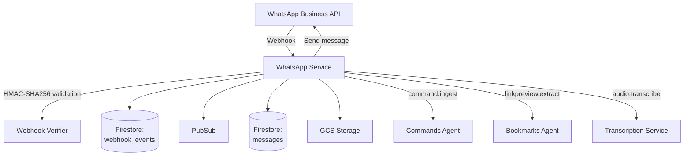

# WhatsApp Service - Technical Reference

## Overview

WhatsApp-service receives WhatsApp Business webhooks, validates signatures, stores messages, downloads media, and routes events via Pub/Sub for async processing.

## Architecture



## API Endpoints

### Webhook Endpoints

| Method | Path                 | Description                                  | Auth           |
| ------  | --------------------  | --------------------------------------------  | --------------  |
| GET    | `/whatsapp/webhooks` | Webhook verification (returns hub.challenge) | None           |
| POST   | `/whatsapp/webhooks` | Receive webhook events                       | HMAC signature |

### Public Endpoints

| Method | Path                                       | Description                      | Auth         |
| ------  | ------------------------------------------  | --------------------------------  | ------------  |
| GET    | `/whatsapp/messages`                       | List user's messages (paginated) | Bearer token |
| GET    | `/whatsapp/messages/:message_id/media`     | Get signed URL for media         | Bearer token |
| GET    | `/whatsapp/messages/:message_id/thumbnail` | Get signed URL for thumbnail     | Bearer token |
| DELETE | `/whatsapp/messages/:message_id`           | Delete message                   | Bearer token |
| POST   | `/whatsapp/connect`                        | Connect/update WhatsApp mapping  | Bearer token |
| GET    | `/whatsapp/status`                         | Get mapping status               | Bearer token |
| DELETE | `/whatsapp/disconnect`                     | Disconnect mapping               | Bearer token |

### Internal Endpoints

| Method | Path                                         | Description                  | Auth         |
| ------  | --------------------------------------------  | ----------------------------  | ------------  |
| POST   | `/internal/whatsapp/pubsub/process-webhook`  | Process webhook from Pub/Sub | Pub/Sub OIDC |
| POST   | `/internal/whatsapp/pubsub/transcribe-audio` | Process audio transcription  | Pub/Sub OIDC |
| POST   | `/internal/whatsapp/pubsub/send-message`     | Send WhatsApp message        | Pub/Sub OIDC |
| POST   | `/internal/whatsapp/pubsub/media-cleanup`    | Delete GCS media files       | Pub/Sub OIDC |

## Domain Models

### Message

| Field              | Type             | Description                   |
| ------------------  | ----------------  | -----------------------------  |   |   |
| `id`               | string           | Unique message identifier     |
| `userId`           | string           | User who received the message |
| `waMessageId`      | string           | WhatsApp message ID           |
| `fromNumber`       | string           | Sender's phone number         |
| `toNumber`         | string           | Recipient phone number        |
| `text`             | string           | Message text (text messages)  |
| `mediaType`        | 'text' \         | 'image' \                     | 'audio' | Message type |
| `gcsPath`          | string           | GCS path to media file        |
| `thumbnailGcsPath` | string           | GCS path to thumbnail         |
| `caption`          | string \         | null                          | Media caption |
| `transcription`    | Transcription \  | null                          | Audio transcription result |
| `linkPreview`      | LinkPreview \    | null                          | Extracted link metadata |
| `timestamp`        | string           | WhatsApp timestamp            |
| `receivedAt`       | string           | ISO 8601 receive time         |
| `webhookEventId`   | string           | Associated webhook event      |

### Transcription

| Field    | Type         | Description     |
| --------  | ------------  | ---------------  |   |   |
| `status` | 'pending' \  | 'processing' \  | 'completed' \ | 'failed' |
| `text`   | string \     | null            | Transcribed text |
| `error`  | object \     | null            | Error details if failed |

### LinkPreview

| Field      | Type          | Description        |
| ----------  | -------------  | ------------------  |   |
| `status`   | 'pending' \   | 'completed' \      | 'failed' |
| `previews` | PreviewItem[] | Extracted previews |
| `error`    | object \      | null               | Error details if failed |

### WebhookEvent

| Field            | Type         | Description                   |
| ----------------  | ------------  | -----------------------------  |   |   |   |   |
| `id`             | string       | Unique event ID               |
| `payload`        | object       | Raw webhook payload           |
| `signatureValid` | boolean      | Signature verification result |
| `receivedAt`     | string       | ISO 8601 timestamp            |
| `phoneNumberId`  | string       | WhatsApp phone number ID      |
| `status`         | 'pending' \  | 'processing' \                | 'completed' \ | 'failed' \ | 'ignored' \ | 'user_unmapped' |

### UserMapping

| Field          | Type     | Description              |
| --------------  | --------  | ------------------------  |
| `id`           | string   | Unique mapping ID        |
| `userId`       | string   | User ID                  |
| `phoneNumbers` | string[] | Associated phone numbers |
| `connected`    | boolean  | Connection status        |

## Pub/Sub Events

### Published

| Event Type                     | Topic                       | Purpose                     |
| ------------------------------  | ---------------------------  | ---------------------------  |
| `whatsapp.webhook.process`     | `whatsapp-webhook-process`  | Async webhook processing    |
| `whatsapp.media.cleanup`       | `whatsapp-media-cleanup`    | Media deletion              |
| `whatsapp.audio.transcribe`    | `whatsapp-audio-transcribe` | Audio transcription trigger |
| `whatsapp.linkpreview.extract` | `whatsapp-linkpreview`      | Link preview extraction     |
| `command.ingest`               | `command-ingest`            | Command processing          |

### Subscribed

| Event Type                  | Handler                                      |
| ---------------------------  | --------------------------------------------  |
| `whatsapp.webhook.process`  | `/internal/whatsapp/pubsub/process-webhook`  |
| `whatsapp.audio.transcribe` | `/internal/whatsapp/pubsub/transcribe-audio` |
| `whatsapp.message.send`     | `/internal/whatsapp/pubsub/send-message`     |
| `whatsapp.media.cleanup`    | `/internal/whatsapp/pubsub/media-cleanup`    |

## Dependencies

### Infrastructure

| Component                               | Purpose               |
| ---------------------------------------  | ---------------------  |
| Firestore (`messages` collection)       | Message persistence   |
| Firestore (`webhook_events` collection) | Webhook event log     |
| Firestore (`user_mappings` collection)  | Phone number mappings |
| GCS                                     | Media storage         |
| Pub/Sub                                 | Event distribution    |

### External APIs

| Service            | Purpose                       |
| ------------------  | -----------------------------  |
| WhatsApp Cloud API | Media download, send messages |

## Configuration

| Environment Variable                          | Required | Description                                  |
| ---------------------------------------------  | --------  | --------------------------------------------  |
| `INTEXURAOS_APP_SECRET`                       | Yes      | WhatsApp app secret for signature validation |
| `INTEXURAOS_VERIFY_TOKEN`                     | Yes      | Webhook verification token                   |
| `INTEXURAOS_ALLOWED_WABA_IDS`                 | Yes      | Comma-separated WABA IDs                     |
| `INTEXURAOS_ALLOWED_PHONE_NUMBER_IDS`         | Yes      | Comma-separated phone number IDs             |
| `INTEXURAOS_INTERNAL_AUTH_TOKEN`              | Yes      | Shared secret for internal endpoints         |
| `INTEXURAOS_GCP_PROJECT_ID`                   | Yes      | Google Cloud project ID                      |
| `INTEXURAOS_GCS_BUCKET_NAME`                  | Yes      | GCS bucket for media                         |
| `INTEXURAOS_PUBSUB_WHATSAPP_WEBHOOK_PROCESS`  | Yes      | Webhook processing topic                     |
| `INTEXURAOS_PUBSUB_WHATSAPP_AUDIO_TRANSCRIBE` | Yes      | Audio transcription topic                    |
| `INTEXURAOS_PUBSUB_COMMAND_INGEST`            | Yes      | Command ingest topic                         |
| `INTEXURAOS_PUBSUB_WHATSAPP_LINKPREVIEW`      | Yes      | Link preview topic                           |
| `INTEXURAOS_PUBSUB_WHATSAPP_MEDIA_CLEANUP`    | Yes      | Media cleanup topic                          |

## Gotchas

**Webhook signature validation** - Uses HMAC-SHA256 with app secret. Must validate before processing.

**Per-user phone numbers** - Each user has their own WhatsApp number. Messages are routed by phone number lookup.

**GCS path format** - `whatsapp-media/{userId}/{messageId}.{extension}` for main media, `thumbnails/` subfolder for thumbnails.

**Signed URL expiry** - Media URLs expire after 15 minutes. Regenerate via GET endpoint.

**User unmapped handling** - Messages from unknown phone numbers are marked `user_unmapped` but not failed.

**Confirmation messages** - Sent after successful processing. Can fail silently without affecting main flow.

**Audio transcription** - Handled by separate service via Pub/Sub. Original message has `status=pending`.

**Link preview** - Fetched async by bookmarks-agent. Original message has `status=pending`.

## File Structure

```
apps/whatsapp-service/src/
  domain/
    whatsapp/
      ports/
        webhookEventRepository.ts
        messageRepository.ts
        mediaStorage.ts
        userMappingRepository.ts
        whatsappCloudApi.ts
      usecases/
        processAudioMessage.ts
        processImageMessage.ts
    models/
      message.ts
      webhookEvent.ts
      userMapping.ts
  infra/
    firestore/
      webhookEventRepository.ts
      messageRepository.ts
      userMappingRepository.ts
    gcs/
      mediaStorage.ts
    whatsapp/
      cloudApiClient.ts
    thumbnail/
      thumbnailGenerator.ts
  routes/
    webhookRoutes.ts
    messageRoutes.ts
    userMappingRoutes.ts
    internalRoutes.ts
    shared.ts
    schemas.ts
    signature.ts
```
