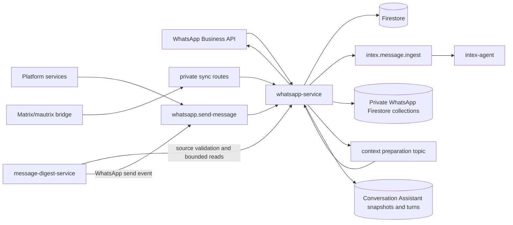

# WhatsApp Service Technical Reference

WhatsApp Service owns the WhatsApp Business API boundary: webhook verification, webhook persistence, inbound text routing, outbound sends, media cleanup, phone verification, private WhatsApp mirror persistence, Message Digest source fencing, and Message Digest delivery execution.

## Architecture

```mermaid
flowchart LR
    Meta[WhatsApp Business API] --> WS[whatsapp-service]
    WS --> Store[(Firestore)]
    WS --> IntexTopic[intex.message.ingest]
    IntexTopic --> Intex[intex-agent]
    Services[Platform services] --> SendTopic[whatsapp.send-message]
    SendTopic --> WS
    WS --> Meta
    Matrix[Matrix/mautrix bridge] --> PrivateSync[private sync routes]
    PrivateSync --> WS
    WS --> PrivateStore[(Private WhatsApp Firestore collections)]
    WS --> ContextWork[context preparation topic]
    ContextWork --> WS
    WS --> AssistantStore[(Conversation Assistant snapshots and turns)]
    Digest[message-digest-service] -->|source validation and bounded reads| WS
    Digest -->|WhatsApp send event| SendTopic
```

## Service Container

`services.ts` wires the private workspace through `privateWhatsAppRepository`, alongside the existing webhook, message, outbound message, preferences, media, Pub/Sub, WhatsApp Cloud API, thumbnail, and link preview adapters.

## Public Routes

Routes are listed by their service-relative Fastify paths.

| Method | Path | Purpose |
| --- | --- | --- |
| `GET` | `/messages` | List assistant WhatsApp messages for the authenticated user |
| `GET` | `/private/account` | Read the authenticated user's private mirror account |
| `PUT` | `/private/account` | Enable or update the private mirror account after connected-phone validation |
| `DELETE` | `/private/account` | Disable the private mirror account |
| `GET` | `/private/chats` | List private chats for the authenticated user |
| `GET` | `/private/chats/:chatId/messages` | List private messages for one chat |
| `GET` | `/private/senders` | List private senders |
| `GET` | `/private/messages` | List private messages by sender |
| `GET` | `/private/sender-days` | List private sender-day aggregates |
| `GET` | `/conversation-assistant/sessions` | List Conversation Assistant analyses |
| `POST` | `/conversation-assistant/sessions` | Create and asynchronously prepare an immutable initial analysis |
| `GET` | `/conversation-assistant/sessions/:sessionId` | Read one analysis, durable turns, and continuation availability |
| `DELETE` | `/conversation-assistant/sessions/:sessionId` | Delete one analysis and all of its dependent snapshots |
| `POST` | `/conversation-assistant/sessions/:sessionId/context-attachments` | Freeze a new continuation cutoff and queue preparation |
| `GET` | `/conversation-assistant/sessions/:sessionId/context-attachments/:attachmentId` | Read safe preparation status and immutable summary |
| `GET` | `/conversation-assistant/sessions/:sessionId/context-attachments/:attachmentId/messages` | Read cursor-paginated safe preview projections |
| `DELETE` | `/conversation-assistant/sessions/:sessionId/context-attachments/:attachmentId` | Remove an uncommitted context update |
| `POST` | `/conversation-assistant/sessions/:sessionId/context-attachments/:attachmentId/preparation/retry` | Retry the same frozen preparation boundary |
| `POST` | `/conversation-assistant/sessions/:sessionId/turns` | Atomically commit a question, optional context update, and durable request |
| `POST` | `/conversation-assistant/sessions/:sessionId/turns/stream` | Stream a durable turn while preserving replay semantics |
| `GET` | `/conversation-assistant/sessions/:sessionId/turn-requests/:requestId` | Recover one durable turn request after disconnect |
| `POST` | `/conversation-assistant/sessions/:sessionId/turn-requests/:requestId/answer/retry` | Retry only a failed model answer without appending another user turn |

Account responses expose `sourceAccountId` so the authenticated user can identify the active mirror account. Other private read responses omit owner-only storage fields such as `userId`, `sourceAccountId`, Matrix room IDs, raw Matrix events, and Matrix sender identifiers.

## Internal Routes

| Method | Path | Purpose |
| --- | --- | --- |
| `POST` | `/internal/whatsapp/pubsub/process-webhook` | Process persisted webhook events |
| `POST` | `/internal/whatsapp/pubsub/send-message` | Send outbound WhatsApp messages |
| `POST` | `/internal/whatsapp/pubsub/media-cleanup` | Delete expired stored media |
| `POST` | `/internal/whatsapp/webhooks/retry-pending` | Retry persisted webhook events |
| `POST` | `/internal/whatsapp/private/events` | Ingest private Matrix bridge events |
| `GET` | `/internal/whatsapp/private/messages` | Query private messages by source account, sender, day, and time range |
| `GET` | `/internal/whatsapp/private/sender-days` | Query private sender-day aggregates |
| `POST` | `/internal/whatsapp/private/aggregates/rebuild` | Rebuild private sender and sender-day aggregates |
| `POST` | `/internal/whatsapp/private/digest-source/validate` | Validate an owned private group/direct chat and issue a source revision |
| `POST` | `/internal/whatsapp/private/digest-source/messages/query` | Read one bounded page under the exact account generation and source revision |
| `POST` | `/internal/whatsapp/delivery-readiness/get` | Resolve delivery readiness for the user's first mapped phone number |
| `POST` | `/internal/whatsapp/outbound-deliveries/get` | Read a user-bound idempotent delivery receipt |
| `POST` | `/internal/whatsapp/outbound-deliveries/retry` | Authorize one byte-identical retry after a definitive failure |
| `POST` | `/internal/whatsapp/private/accounts/:sourceAccountId/erasure` | Start an idempotent, generation-fenced physical privacy cascade |
| `GET` | `/internal/whatsapp/private/accounts/:sourceAccountId/erasure/:erasureRequestId` | Read content-free physical erasure progress |
| `POST` | `/internal/whatsapp/pubsub/conversation-assistant-prepare` | Prepare an initial Conversation Assistant snapshot |
| `POST` | `/internal/whatsapp/pubsub/conversation-assistant-context-attachment-prepare` | Prepare one frozen continuation update |

Every internal route must call `logIncomingRequest()` before auth validation.

## Message Digest Source and Delivery

`/internal/whatsapp/private/digest-source/validate` derives the user's active private account, verifies ownership of the requested chat, accepts only `group` or `direct`, and returns a safe label plus a signed source revision. The revision covers user, source account, account generation, chat identity, chat type, and context-change journal head.

`/internal/whatsapp/private/digest-source/messages/query` requires the same fenced source fields, an ISO time window, a maximum page size of 200, and an optional opaque cursor. It returns safe message references, timestamps, direction, bounded author labels, projected text, content kind, source revision, high watermark, and next cursor. Redacted, deleted, and relation-only rows are excluded. Logs never include request bodies or projected text.

`/internal/whatsapp/delivery-readiness/get` inspects the user's mapping in stored order. It reports `ready` with only a masked primary number, or `mapping_missing`, `disconnected`, or `delivery_disabled`. The actual destination is always the first mapped phone number; callers cannot override it.

New Message Digest Pub/Sub events use `kind: message_digest_v2`, the approved Polish `intexuraos_message_digest_v4` Meta template, six bounded body parameters, template-owned line breaks, a validated run deep-link suffix, and `message-digest:<runId>` idempotency. WhatsApp Service maps the first importance-ordered section to `NAJWAŻNIEJSZE`, routes later question sections to `CO DALEJ` and the remaining factual sections to `USTALENIA I FAKTY`, removes redundant dynamic titles, and compacts each section's complete items into one provider-safe line. It trims the lowest-priority slot first when an older frozen payload would otherwise push the fully resolved template above 1,024 code points; no parameter contains a newline, tab, or hidden layout control. The consumer retains v1 decoding only for already-frozen outbox deliveries. Before provider execution, WhatsApp Service acquires a run-bound authorization from Message Digest Service. Delivery receipts distinguish `pending`, `sent`, `ambiguous`, and definitive `failed`; retry authorization requires the identical payload digest and rejects ambiguous state.

## Event Contract

| Event | Purpose |
| --- | --- |
| `intex.message.ingest` | Text or stored-image payload for Intex Agent |
| `whatsapp.message.send` | Outbound message request |
| `whatsapp.media.cleanup` | Media cleanup request |
| `whatsapp.webhook.process` | Async processing request for persisted webhook events |
| `whatsapp.linkpreview.extract` | Link preview extraction request for web-agent |
| `whatsapp.conversation-assistant.prepare` | Prepare an immutable initial analysis snapshot |
| `whatsapp.conversation-assistant.context-attachment.prepare` | Prepare an immutable continuation update |
| `whatsapp.private-account.erasure` | Advance one bounded physical-erasure batch |

## Media, Transcript, And Analysis Routes

| Method | Path | Purpose |
| --- | --- | --- |
| `PATCH` | `/private/chats/:chatId/transcription` | Update the owned chat’s transcription setting |
| `GET` | `/private/messages/:messageId/media` | Owner-checked original media access |
| `GET` | `/private/messages/:messageId/thumbnail` | Owner-checked image thumbnail access |
| `POST` | `/conversation-assistant/context/check` | Check proposed source-context availability |
| `GET` | `/conversation-assistant/sessions/:sessionId/context` | Inspect the prepared initial context |
| `GET` | `/conversation-assistant/sessions/:sessionId/context/history` | Inspect committed context history |
| `GET` | `/conversation-assistant/sessions/:sessionId/export.pdf` | Export the owned analysis as binary PDF |

Session creation accepts an optional supported `model`. The model is stored with the session; prompt-budget checks use that model’s supported input limit. Reactions are projected beside source messages, while relation-only rows do not become ordinary digest content.

Matrix corpus control routes coordinate evaluation transport with intex-agent. Evaluation action tools remain mocked, and evidence/logging must not expose raw private content.

## Private Workspace Storage

The private workspace uses these Firestore collections:

| Collection | Purpose |
| --- | --- |
| `whatsapp_private_accounts` | One private mirror account per user |
| `whatsapp_private_chats` | Chat metadata keyed from source account and Matrix room ID |
| `whatsapp_private_messages` | Private messages keyed from source account and Matrix event ID |
| `whatsapp_private_senders` | Sender aggregates keyed from source account and sender key |
| `whatsapp_private_sender_days` | Sender/day aggregates keyed from source account, sender key, and day |
| `whatsapp_private_context_changes` | Monotonic, immutable safe projections of context-affecting source changes |
| `whatsapp_conversation_assistant_sessions` | Analysis metadata, generation fence, revision, and continuation watermarks |
| `whatsapp_conversation_assistant_turns` | Durable user and assistant timeline turns |
| `whatsapp_conversation_assistant_context_attachments` | Immutable continuation draft/commit manifests and safe summaries |
| `whatsapp_conversation_assistant_turn_requests` | Durable idempotency fingerprints, leases, and answer recovery state |
| `whatsapp_conversation_assistant_transcript_chunks` | Chunked immutable initial snapshots |
| `whatsapp_conversation_assistant_context_chunks` | Chunked immutable continuation snapshots |

Private event ingest accepts `deliveryMode` values `live` and `backfill`. Message directions are `incoming` and `outgoing`; chat types are normalized to `direct`, `group`, or `unknown`; message types are normalized to text, image, audio, video, file, sticker, reaction, redaction, or unknown.

Private day keys are generated in the `Europe/Warsaw` time zone. Sender keys prefer a normalized phone number (`phone:+...`) and fall back to the Matrix sender ID (`matrix:...`) when phone metadata is missing.

## Conversation Assistant Continuation Model

The initial transcript is immutable. Every context update records a server commit time, event-time range, monotonic source-change cutoff, previous and next chain hashes, counts, omission breakdown, and correction breakdown. Source reconstruction uses both the event frontier and the journal watermark, so late imports and mutations of earlier messages cannot disappear between snapshots.

The production Matrix sync path receives message removal as `m.room.redaction`, including removals initiated from WhatsApp. It has no second trustworthy deletion signal, so new journal writes use `redacted` and public counts/previews/acknowledgments fold any older stored `deleted` tombstone into `redacted`. The service never guesses deletion semantics from Matrix reason text, sender identity, or absent content.

Creating an attachment freezes its cutoff and queues preparation. Preparation publishes chunks first and the ready manifest last. Pending metadata and chunks share a native Firestore `expireAt` timestamp. The manifest is capped at 400 chunks; 401 fails with no truncation. Atomic send reads and verifies every manifested chunk, clears every pending TTL, persists the user turn/request boundary, advances the session revision and continuation watermark, and marks the attachment committed in one transaction.

The durable turn request is keyed by a client-generated `requestId` plus a fingerprint of the immutable body. Identical replay returns the stored request; a different body for the same id conflicts. Only one lease may call the model. The deterministic acknowledgment is persisted separately from the model's answer, so SSE, reload, later prompts, and PDF do not duplicate it. Answer retry reuses the already committed prompt snapshot and never reads live WhatsApp data.

Prompt V5 treats every WhatsApp message and correction as untrusted quoted data. It receives the integrity-verified initial transcript, ordered completed turns, immutable context updates, and the current question. A serialized hard limit is enforced before creating a provider client.

## Cleanup, Privacy, and Observability

Deleting one analysis uses its deletion token and generation fence, then removes turns, requests, attachment metadata, and every transcript/context chunk before the session document. It does not delete source WhatsApp data.

Physical private-account erasure is a separate internal-authenticated workflow. Its idempotent request disables and fences the old account generation, then advances a bounded cascade through every dependent analysis and private source projection. Counts and status are durable, so Pub/Sub redelivery resumes after a partial failure. The old generation cannot write data after the fence; reconnecting creates a new source generation. Public `DELETE /private/account` remains a reversible disable operation.

Request logs and Sentry transactions use registered route templates. Dynamic session, attachment, request, source-account identifiers, query strings, prompts, message text, labels, hashes, and previews must not appear in metrics or structured logs.

Conversation Assistant metrics use fixed operation/outcome labels only. Dedicated numeric measures cover included, omitted, corrected, redacted, newly available, and late-ingested message counts; conservative estimated tokens; prompt-budget rejections; time to first model delta; two-tab conflicts; and orphan chunk cleanup. None of these measures carries user, session, chat, request, source-message, content, or hash dimensions.

## Private WhatsApp Media Storage

Private image, audio, video, and file media synchronized from Matrix can be copied into the private WhatsApp media bucket before the message event is ingested. Images receive thumbnails; audio/video originals support playback and enabled transcription. The Matrix adapter owns Matrix media downloads. `whatsapp-service` owns GCS upload, thumbnail generation, Firestore metadata, and signed URL access.

Stored private media uses `whatsapp/private/{userId}/{messageId}/{mediaId}.{ext}` and `whatsapp/private/{userId}/{messageId}/{mediaId}_thumb.jpg`. Browser reads use owner-checked signed URL routes. Internal processors use the internal signed URL route with `sourceAccountId` validation.

Messages without stored media remain placeholders until media recovery or backfill supplies valid metadata. Backfill and signed access preserve account-generation and ownership checks.

## Voice Boundary

Audio/voice webhook events pass through `ProcessAudioMessageUseCase`, which stores the media and publishes an audio-stored event for transcription. Audio alone does not create an Intex message ingest. A later text reply to completed audio can attach the transcript as bounded reply context; incomplete or unsafe transcript context is not forwarded.

Buttons with an `intex_confirm:` identifier are forwarded as `whatsapp_button` events to confirm or cancel Intex actions. Other retired workflow buttons remain ignored.

## Intex Image Forwarding

Assistant WhatsApp image messages are downloaded, thumbnailed, stored in GCS, and then published to `intex.message.ingest` with `sourceType: whatsapp_image`. The event text is the WhatsApp caption or an empty string. `sourceUrl` is a signed URL for the stored original image.

If the signed URL or Intex ingest publish fails, webhook processing is marked failed and retryable so External Save does not silently miss the image.
