# WhatsApp Service - Technical Reference

## Overview

WhatsApp-service is the integration layer between WhatsApp Business API and IntexuraOS. It receives webhooks from Meta, validates signatures, stores messages in Firestore, downloads media to GCS, tracks outbound messages for reply correlation, and publishes events via Pub/Sub for async processing. Runs on Cloud Run with auto-scaling.

## Architecture


## Data Flow

### Inbound Message Flow

```mermaid
sequenceDiagram
    autonumber
    participant WA as WhatsApp
    participant WS as WhatsApp Service
    participant FS as Firestore
    participant PS as Pub/Sub
    participant AA as Actions Agent

    WA->>+WS: POST /whatsapp/webhooks
    WS->>WS: Validate HMAC-SHA256 signature
    WS->>WS: Validate WABA ID & Phone Number ID
    WS->>FS: Save webhook_event (status=pending)
    WS->>PS: Publish whatsapp.webhook.process
    WS-->>-WA: 200 OK (fast response)

    Note over WS: Async processing via Pub/Sub

    PS->>+WS: POST /internal/.../process-webhook
    WS->>FS: Lookup user by phone number
    WS->>FS: Save whatsapp_message
    WS->>FS: Update webhook_event (status=completed)

    alt Text Reply to Approval Message
        WS->>FS: Find OutboundMessage by replyToWamid
        WS->>WS: Extract actionId from correlationId
        WS->>PS: Publish action.approval.reply (with actionId)
        Note over WS: Skip command.ingest for approval replies
    else Reaction Message
        WS->>FS: Find OutboundMessage by messageId
        WS->>WS: Map emoji to intent (👍=approve, 👎=reject)
        WS->>PS: Publish action.approval.reply
    else Regular Text Message
        WS->>PS: Publish command.ingest
        WS->>PS: Publish whatsapp.linkpreview.extract
    end

    WS-->>-PS: Ack
```



### Approval Reply Correlation (v2.0.0)

```mermaid
sequenceDiagram
    autonumber
    participant AA as Actions Agent
    participant WS as WhatsApp Service
    participant WA as WhatsApp
    participant FS as Firestore
    participant User

    AA->>WS: POST /internal/.../send-message
    Note over WS: correlationId: action-todo-approval-{actionId}
    WS->>WA: Send approval request message
    WA-->>WS: Return wamid
    WS->>FS: Save OutboundMessage (wamid, correlationId)
    WS-->>AA: 200 OK with wamid

    User->>WA: Reply "yes" or React 👍

    WA->>WS: Webhook (reply or reaction)
    WS->>FS: Find OutboundMessage by wamid
    WS->>WS: Parse correlationId for actionId
    WS->>AA: Publish action.approval.reply (with actionId)
    Note over AA: Process approval with known actionId
```



## Recent Changes

| Commit     | Description                                              | Date       |
| ---------- | -------------------------------------------------------- | ---------- |
| `01c99b31` | Only publish approval reply events when actionId found   | 2026-01-16 |
| `575379e8` | PR review findings for INT-208 and INT-203               | 2026-01-15 |
| `fc3f8663` | Skip command.ingest for approval replies with actionId   | 2026-01-14 |
| `a9a14960` | Support WhatsApp reactions for action approval/rejection | 2026-01-13 |
| `844bfa38` | Apply PR review suggestions for approval replies         | 2026-01-12 |
| `595b5ab6` | Enable WhatsApp replies for approval requests            | 2026-01-11 |
| `37551ab3` | Fix WhatsApp voice note transcription bugs               | 2026-01-10 |

## API Endpoints

### Webhook Endpoints

| Method | Path                 | Description                                  | Auth           |
| ------ | -------------------- | -------------------------------------------- | -------------- |
| GET    | `/whatsapp/webhooks` | Webhook verification (returns hub.challenge) | None           |
| POST   | `/whatsapp/webhooks` | Receive webhook events                       | HMAC signature |

### Public Endpoints

| Method | Path                                       | Description                      | Auth         |
| ------ | ------------------------------------------ | -------------------------------- | ------------ |
| GET    | `/whatsapp/messages`                       | List user's messages (paginated) | Bearer token |
| GET    | `/whatsapp/messages/:message_id/media`     | Get signed URL for media         | Bearer token |
| GET    | `/whatsapp/messages/:message_id/thumbnail` | Get signed URL for thumbnail     | Bearer token |
| DELETE | `/whatsapp/messages/:message_id`           | Delete message                   | Bearer token |
| POST   | `/whatsapp/connect`                        | Connect/update WhatsApp mapping  | Bearer token |
| GET    | `/whatsapp/status`                         | Get mapping status               | Bearer token |
| DELETE | `/whatsapp/disconnect`                     | Disconnect mapping               | Bearer token |

### Internal Endpoints

| Method | Path                                         | Description                  | Auth         |
| ------ | -------------------------------------------- | ---------------------------- | ------------ |
| POST   | `/internal/whatsapp/pubsub/process-webhook`  | Process webhook from Pub/Sub | Pub/Sub OIDC |
| POST   | `/internal/whatsapp/pubsub/transcribe-audio` | Process audio transcription  | Pub/Sub OIDC |
| POST   | `/internal/whatsapp/pubsub/send-message`     | Send WhatsApp message        | Pub/Sub OIDC |
| POST   | `/internal/whatsapp/pubsub/media-cleanup`    | Delete GCS media files       | Pub/Sub OIDC |

## Domain Models

### WhatsAppMessage

| Field              | Type                  | Description                        |
| ------------------ | --------------------- | ---------------------------------- | -------------------------- | ------------ |
| `id`               | string                | Unique message identifier          |
| `userId`           | string                | User who received the message      |
| `waMessageId`      | string                | WhatsApp message ID                |
| `fromNumber`       | string                | Sender's phone number              |
| `toNumber`         | string                | Recipient phone number             |
| `text`             | string                | Message text (text messages)       |
| `mediaType`        | `text` \              | `image` \                          | `audio`                    | Message type |
| `gcsPath`          | string                | GCS path to media file             |
| `thumbnailGcsPath` | string                | GCS path to thumbnail              |
| `caption`          | string \              | null                               | Media caption              |
| `transcription`    | TranscriptionState \  | null                               | Audio transcription result |
| `linkPreview`      | LinkPreviewState \    | null                               | Extracted link metadata    |
| `timestamp`        | string                | WhatsApp timestamp                 |
| `receivedAt`       | string                | ISO 8601 receive time              |
| `webhookEventId`   | string                | Associated webhook event           |
| `metadata`         | object                | Additional data (senderName, etc.) |

### OutboundMessage (v2.0.0)

Tracks sent messages for reply correlation. Uses wamid as document ID for efficient lookups.

| Field           | Type   | Description                                 |
| --------------- | ------ | ------------------------------------------- |
| `wamid`         | string | WhatsApp message ID (document ID)           |
| `correlationId` | string | Format: `action-{type}-approval-{actionId}` |
| `userId`        | string | Target user ID                              |
| `sentAt`        | string | ISO 8601 send time                          |
| `expiresAt`     | number | Unix timestamp for TTL (7 days)             |

### TranscriptionState

| Field     | Type         | Description     |
| --------- | ------------ | --------------- | ----------------------- | -------- | ---------------------- |
| `status`  | `pending` \  | `processing` \  | `completed` \           | `failed` | Transcription progress |
| `text`    | string \     | null            | Full transcribed text   |
| `summary` | string \     | null            | AI-generated key points |
| `error`   | object \     | null            | Error details if failed |

### WebhookEvent

| Field            | Type         | Description                   |
| ---------------- | ------------ | ----------------------------- | -------------- | ----------- | ------------ | --------------- | ----------------- |
| `id`             | string       | Unique event ID               |
| `payload`        | object       | Raw webhook payload           |
| `signatureValid` | boolean      | Signature verification result |
| `receivedAt`     | string       | ISO 8601 timestamp            |
| `phoneNumberId`  | string       | WhatsApp phone number ID      |
| `status`         | `pending` \  | `processing` \                | `completed` \  | `failed` \  | `ignored` \  | `user_unmapped` | Processing status |

### UserMapping

| Field          | Type     | Description              |
| -------------- | -------- | ------------------------ |
| `id`           | string   | Unique mapping ID        |
| `userId`       | string   | User ID                  |
| `phoneNumbers` | string[] | Associated phone numbers |
| `connected`    | boolean  | Connection status        |

## Pub/Sub Events

### Published Events

| Event Type                     | Topic                       | Purpose                     |
| ------------------------------ | --------------------------- | --------------------------- |
| `whatsapp.webhook.process`     | `whatsapp-webhook-process`  | Async webhook processing    |
| `whatsapp.media.cleanup`       | `whatsapp-media-cleanup`    | Media deletion              |
| `whatsapp.audio.transcribe`    | `whatsapp-audio-transcribe` | Audio transcription trigger |
| `whatsapp.linkpreview.extract` | `whatsapp-linkpreview`      | Link preview extraction     |
| `command.ingest`               | `command-ingest`            | Command processing          |
| `action.approval.reply`        | `action-approval-reply`     | Approval response (v2.0.0)  |

### Subscribed Events

| Event Type                  | Handler                                      |
| --------------------------- | -------------------------------------------- |
| `whatsapp.webhook.process`  | `/internal/whatsapp/pubsub/process-webhook`  |
| `whatsapp.audio.transcribe` | `/internal/whatsapp/pubsub/transcribe-audio` |
| `whatsapp.message.send`     | `/internal/whatsapp/pubsub/send-message`     |
| `whatsapp.media.cleanup`    | `/internal/whatsapp/pubsub/media-cleanup`    |

### ApprovalReplyEvent (v2.0.0)

```typescript
interface ApprovalReplyEvent {
  type: 'action.approval.reply';
  replyToWamid: string; // Original approval message wamid
  replyText: string; // User's reply text (or "yes"/"no" for reactions)
  userId: string;
  timestamp: string;
  actionId?: string; // Extracted from correlationId when available
}
```

## Dependencies

### Firestore Collections

| Collection                   | Purpose                            | Owner            |
| ---------------------------- | ---------------------------------- | ---------------- |
| `whatsapp_messages`          | Message persistence                | whatsapp-service |
| `webhook_events`             | Webhook event log                  | whatsapp-service |
| `user_mappings`              | Phone number mappings              | whatsapp-service |
| `whatsapp_outbound_messages` | Outbound message tracking (v2.0.0) | whatsapp-service |

### External APIs

| Service            | Purpose                       |
| ------------------ | ----------------------------- |
| WhatsApp Cloud API | Media download, send messages |
| Speechmatics       | Audio transcription           |

### Internal Services

| Service         | Endpoint/Topic          | Purpose                    |
| --------------- | ----------------------- | -------------------------- |
| actions-agent   | `action-approval-reply` | Process approval responses |
| commands-agent  | `command-ingest`        | Command classification     |
| bookmarks-agent | `whatsapp-linkpreview`  | Link preview extraction    |

## Configuration

| Environment Variable                          | Required | Description                                  |
| --------------------------------------------- | -------- | -------------------------------------------- |
| `INTEXURAOS_APP_SECRET`                       | Yes      | WhatsApp app secret for signature validation |
| `INTEXURAOS_VERIFY_TOKEN`                     | Yes      | Webhook verification token                   |
| `INTEXURAOS_ALLOWED_WABA_IDS`                 | Yes      | Comma-separated WABA IDs                     |
| `INTEXURAOS_ALLOWED_PHONE_NUMBER_IDS`         | Yes      | Comma-separated phone number IDs             |
| `INTEXURAOS_INTERNAL_AUTH_TOKEN`              | Yes      | Shared secret for internal endpoints         |
| `INTEXURAOS_GCP_PROJECT_ID`                   | Yes      | Google Cloud project ID                      |
| `INTEXURAOS_GCS_BUCKET_NAME`                  | Yes      | GCS bucket for media                         |
| `INTEXURAOS_PUBSUB_WHATSAPP_WEBHOOK_PROCESS`  | Yes      | Webhook processing topic                     |
| `INTEXURAOS_PUBSUB_WHATSAPP_AUDIO_TRANSCRIBE` | Yes      | Audio transcription topic                    |
| `INTEXURAOS_PUBSUB_COMMAND_INGEST`            | Yes      | Command ingest topic                         |
| `INTEXURAOS_PUBSUB_WHATSAPP_LINKPREVIEW`      | Yes      | Link preview topic                           |
| `INTEXURAOS_PUBSUB_WHATSAPP_MEDIA_CLEANUP`    | Yes      | Media cleanup topic                          |
| `INTEXURAOS_PUBSUB_ACTION_APPROVAL_REPLY`     | Yes      | Approval reply topic (v2.0.0)                |

## Gotchas

### Webhook Signature Validation

Uses HMAC-SHA256 with app secret. Must validate before any processing. Signature is in `X-Hub-Signature-256` header.

### Reply Correlation Pattern (v2.0.0)

When sending approval messages, use correlationId format: `action-{type}-approval-{actionId}`. This pattern is parsed by whatsapp-service to extract the actionId when processing replies.

### Preventing Duplicate Actions (v2.0.0)

When a text message is a reply to an approval message with a known actionId, the service:

1. Publishes `action.approval.reply` with the actionId
2. Skips publishing `command.ingest`

This prevents the same reply from creating duplicate actions through both approval and command flows.

### Reaction Emoji Mapping

Only thumbs-up and thumbs-down reactions are processed:

- `👍` (U+1F44D) = approve
- `👎` (U+1F44E) = reject
- Other emojis are ignored (status=`ignored`, reason=`UNSUPPORTED_REACTION`)

### OutboundMessage TTL

Messages in `whatsapp_outbound_messages` expire after 7 days via Firestore TTL policy. Ensure the policy is configured on the `expiresAt` field.

### GCS Path Format

- Media: `whatsapp-media/{userId}/{messageId}.{extension}`
- Thumbnails: `whatsapp-media/{userId}/thumbnails/{messageId}.jpg`

### Signed URL Expiry

Media URLs expire after 15 minutes. Clients should regenerate via GET endpoint when needed.

### User Unmapped Handling

Messages from unknown phone numbers are marked `user_unmapped` but not failed. This allows tracking without losing data.

### Audio Transcription

Handled via Speechmatics Batch API with up to 5 minute polling. Original message has `status=pending` until completion.

## File Structure

```
apps/whatsapp-service/src/
  domain/
    whatsapp/
      ports/
        eventPublisher.ts
        outboundMessageRepository.ts  # v2.0.0
        repositories.ts
        whatsappCloudApi.ts
      usecases/
        processAudioMessage.ts
        processImageMessage.ts
        transcribeAudio.ts
      events/
        events.ts                     # ApprovalReplyEvent (v2.0.0)
      models/
        WhatsAppMessage.ts
  infra/
    firestore/
      webhookEventRepository.ts
      messageRepository.ts
      userMappingRepository.ts
      outboundMessageRepository.ts    # v2.0.0
    gcs/
      mediaStorage.ts
    whatsapp/
      cloudApiClient.ts
    thumbnail/
      thumbnailGenerator.ts
    pubsub/
      publisher.ts
  routes/
    webhookRoutes.ts                  # Reaction/reply handling (v2.0.0)
    messageRoutes.ts
    mappingRoutes.ts
    pubsubRoutes.ts
    shared.ts                         # extractReactionData, extractReplyContext
    schemas.ts
  signature.ts
  config.ts
  services.ts
```
