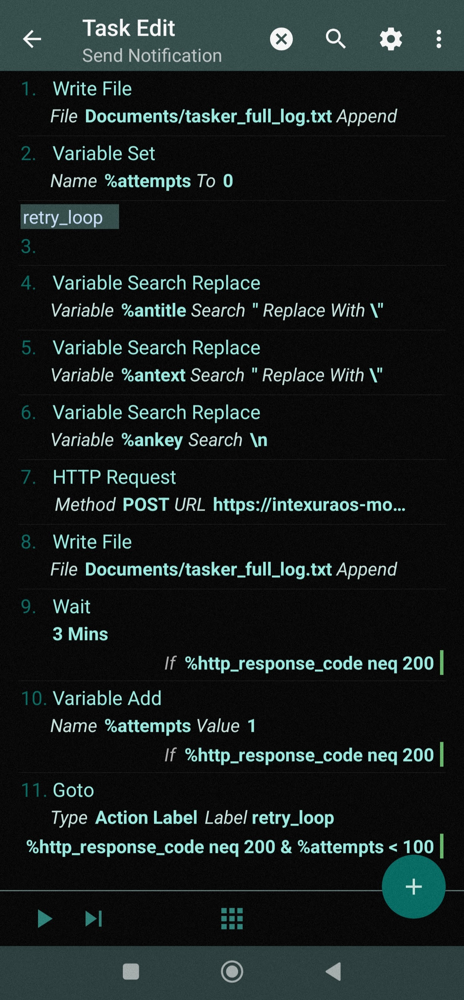

# Mobile Notifications Setup (Xiaomi/HyperOS)

**Device:** Redmi Note 13 Pro 5G  
**OS:** HyperOS (Android 14)  
**Goal:** Intercept notifications from specific apps (e.g., Zen, Revolut, WhatsApp), sanitize data, and send via HTTP POST with unique IDs to prevent deduplication errors.

---

## 1. System Configuration (HyperOS Optimization)

Xiaomi's HyperOS aggressively kills background processes. The following manual overrides are required.

### 1.1. Background Autostart

1. Navigate to **Settings** → **Apps** → **Permissions** → **Background autostart**.
2. Enable the toggle for both **Tasker** and **AutoNotification**.
3. Tap on each app name to ensure "Background autostart" is fully permitted.

### 1.2. Battery Optimization

1. Navigate to **Settings** → **Apps** → **Manage apps**.
2. Locate **Tasker** and **AutoNotification**.
3. Set **Battery saver** to "No restrictions" for both apps.

---

## 2. AutoNotification Intercept Configuration

The Profile serves as the event trigger.

1. **Create Profile:** Open Tasker → **Profiles** → **+** → **Event** → **Plugin** → **AutoNotification** → **Intercept**.
2. **Configuration:**
   - **Action Type:** Set to `Created` to trigger only on new incoming notifications.
   - **Apps:** Filter to your desired apps (e.g., Zen, Revolut, WhatsApp).
   - **Event Behaviour:** Enabled (True).
3. **Variable Names:** The plugin automatically populates local variables like `%antitle`, `%antext`, `%anpackage`, and `%ankey`.

See [08-tasker-configuration.jpg](08-tasker-configuration.jpg) for a visual reference of the configuration screen.

---

## 3. Data Sanitization (Variable Search Replace)

These actions **must be placed at the beginning of the Task** to prevent JSON syntax errors caused by special characters in notification content.

### 3.1. Remove Newlines from Key

- **Action:** Variable Search Replace
- **Variable:** `%ankey`
- **Search:** `\n`
- **Multi-Line:** Enabled
- **Replace Matches:** Enabled
- **Replace With:** _(leave empty)_

### 3.2. Escape Quotes in Title

- **Action:** Variable Search Replace
- **Variable:** `%antitle`
- **Search:** `"`
- **Replace Matches:** Enabled
- **Replace With:** `\"`

### 3.3. Escape Quotes in Text

- **Action:** Variable Search Replace
- **Variable:** `%antext`
- **Search:** `"`
- **Replace Matches:** Enabled
- **Replace With:** `\"`

---

## 4. Tasker Task: Unique ID & Retry Flow

This task handles data transmission to the backend with error handling and local logging.



### 4.1. Flow Logic (Action by Action)

1. **Write File:** Append the initial event data to `Documents/tasker_full_log.txt`.
2. **Variable Search Replace (x3):** Sanitization actions from Step 3.
3. **Variable Set:** Initialize `%attempts` to `0`.
4. **Anchor (retry_loop):** A label for the Goto loop.
5. **HTTP Request:** POST request with the JSON payload.
6. **Write File:** Append the server response (code and content) to the log file.
7. **Wait:** 5 Minutes (Condition: If `%http_response_code` != 200).
8. **Variable Add:** Increment `%attempts` by 1 (Condition: If code != 200).
9. **Goto:** Jump to `retry_loop` (Condition: If code != 200 AND `%attempts` < 100).

### 4.2. HTTP Request Configuration

- **Method:** `POST`
- **URL:** `https://YOUR_SERVICE_URL/mobile-notifications/webhooks`
- **Headers:**
  - `Content-Type: application/json`
  - `X-Mobile-Notifications-Signature: YOUR_SIGNATURE`

### 4.3. JSON Payload (Body)

To prevent WhatsApp updates from being treated as duplicates, the `notification_id` combines the system key with the exact post timestamp:

```json
{
  "source": "tasker",
  "device": "redmi-note-13-pro",
  "timestamp": %TIMES,
  "notification_id": "%ankey_%anposttime",
  "post_time": "%anposttime",
  "app": "%anpackage",
  "title": "%antitle",
  "text": "%antext"
}
```

**Note:** `%anposttime` ensures that even if `%ankey` is the same, every update/new message generates a unique ID.

**Variables:**

| Variable      | Description                                                   |
| ------------- | ------------------------------------------------------------- |
| `%TIMES`      | Current Unix timestamp (seconds)                              |
| `%ankey`      | Unique notification key (e.g., `0\|com.whatsapp.w4b\|101...`) |
| `%anposttime` | Millisecond timestamp when the notification was posted        |
| `%anpackage`  | App package name (e.g., `com.whatsapp.w4b`)                   |
| `%antitle`    | Notification title (sanitized)                                |
| `%antext`     | Notification text content (sanitized)                         |

---

## 5. Debugging & System Behavior

### 5.1. "No active profiles" Status

The notification "No active profiles (1 of 1 enabled)" is **normal**. Event triggers are instantaneous and do not stay "active" in the UI like State-based profiles.

### 5.2. Analyzing Log Errors

| Response Code | Meaning                                             |
| ------------- | --------------------------------------------------- |
| `200`         | Success - notification was received by the server   |
| `401`         | Unauthorized - check your signature header          |
| `400`         | Bad request - verify JSON payload structure         |
| `5xx`         | Server error - retry will handle this automatically |

### 5.3. Variable Issues

- **Empty Variables:** Ensure variables are written in lowercase (e.g., `%antitle`). Uppercase variables like `%ANTITLE` are treated as global and may remain empty.
- **Raw `%http_response_content`:** If this appears in logs, the server returned an empty body (typical for 401 errors).
- **JSON Parse Errors:** If you see "Body is not valid JSON" errors, ensure the sanitization actions are configured correctly.

### 5.4. Persistence

To ensure the service remains alive on HyperOS:

1. Open the Recent Apps view.
2. Long-press the Tasker card and click the **Lock icon** (padlock).
3. Always click the **Checkmark (✓)** in the top right of Tasker after making any changes to commit the configuration.

---

## 6. Getting Your Signature

1. Log in to IntexuraOS web app.
2. Navigate to **Mobile Notifications** in the sidebar.
3. Click **Connect Device** and follow the instructions.
4. Copy the generated signature and paste it into your Tasker HTTP Request header.

**Important:** The signature is only shown once. If you lose it, you'll need to disconnect and reconnect to generate a new one.

---

## 7. Troubleshooting

| Issue                            | Solution                                                       |
| -------------------------------- | -------------------------------------------------------------- |
| Notifications not being captured | Check AutoNotification has Notification Access permission      |
| 401 Unauthorized errors          | Verify your signature is correct and hasn't been regenerated   |
| Tasker killed in background      | Enable autostart and disable battery optimization              |
| Variables empty in payload       | Use lowercase variable names (e.g., `%antitle` not `%ANTITLE`) |
| JSON parse errors (400)          | Ensure sanitization actions escape quotes and remove newlines  |
| WhatsApp duplicates rejected     | Use `%ankey_%anposttime` as notification_id for uniqueness     |

---

## 8. Reference

- [Tasker Configuration Screenshot](08-tasker-configuration.jpg)
- [WhatsApp Business Cloud API Setup](./07-whatsapp-business-cloud-api.md)
