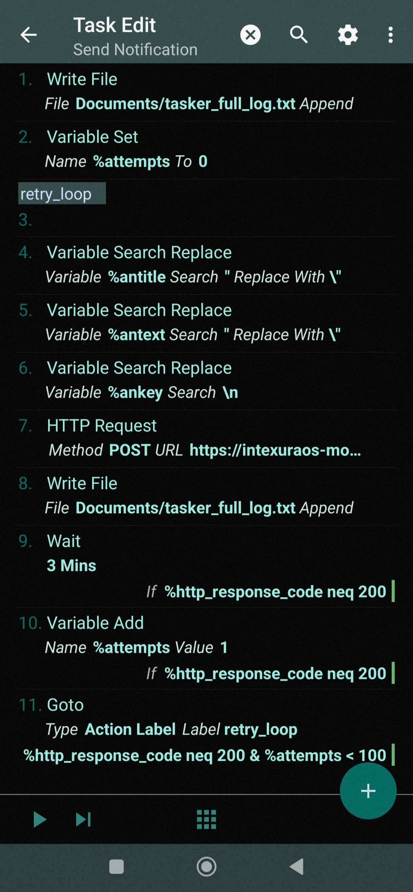

# Mobile Notifications Setup (Xiaomi/HyperOS)

**Device:** Redmi Note 13 Pro 5G  
**OS:** HyperOS (Android 14)  
**Goal:** Intercept notifications from specific apps (e.g., Zen, Revolut, WhatsApp), sanitize data, and send via HTTP POST with unique IDs to prevent deduplication errors.

---

## 1. System Configuration (HyperOS Optimization)

Xiaomi's HyperOS aggressively kills background processes. The following manual overrides are required.

### 1.1. Background Autostart

1. Navigate to **Settings** → **Apps** → **Permissions** → **Background autostart**.
2. Enable the toggle for both **Tasker** and **AutoNotification**.
3. Tap on each app name to ensure "Background autostart" is fully permitted.

### 1.2. Battery Optimization

1. Navigate to **Settings** → **Apps** → **Manage apps**.
2. Locate **Tasker** and **AutoNotification**.
3. Set **Battery saver** to "No restrictions" for both apps.

---

## 2. AutoNotification Intercept Configuration

The Profile serves as the event trigger.

1. **Create Profile:** Open Tasker → **Profiles** → **+** → **Event** → **Plugin** → **AutoNotification** → **Intercept**.
2. **Configuration:**
   - **Action Type:** Set to `Created` to trigger only on new incoming notifications.
   - **Apps:** Filter to your desired apps (e.g., Zen, Revolut, WhatsApp). **Do NOT leave this empty** — an empty list captures ALL apps, including system services that emit rapid-fire updates (see Section 2.1).
   - **Event Behaviour:** Enabled (True).
3. **Variable Names:** The plugin automatically populates local variables like `%antitle`, `%antext`, `%anpackage`, and `%ankey`.

See [08-tasker-configuration.jpg](08-tasker-configuration.jpg) for a visual reference of the configuration screen.

### 2.1. Excluded Apps (Important)

The following system packages produce persistent or rapidly-updating notifications (progress bars, connection status) that trigger hundreds of duplicate events per minute. They **must NOT** be included in the Apps filter above:

| Package                                  | Description  | Why excluded                                                                                                |
| ---------------------------------------- | ------------ | ----------------------------------------------------------------------------------------------------------- |
| `com.google.android.projection.gearhead` | Android Auto | Emits a pulsating "Connecting to Android Auto" progress notification that fires continuous `Created` events |
| `com.android.systemui`                   | System UI    | System-level notifications (volume, brightness) that update rapidly                                         |

If you use a broad app filter or discover a new noisy package, add it to this table and to the Task-level exclusion (Section 3.1).

---

## 3. Task-Level Package Exclusion (Required)

Even with a correct AutoNotification app filter, a **Stop** action at the top of the Tasker Task acts as a safety net against noisy packages. This prevents HTTP requests from being sent if a system notification slips through the profile filter.

### 3.1. Stop Action for Excluded Packages

Add this as **Action 1** in the Task (before everything else, including the Write File log action):

- **Action:** `Task` → `Stop`
- **If:** `%anpackage` **Matches Regex** `com\.google\.android\.projection\.gearhead|com\.android\.systemui`

This immediately exits the task for any excluded package — no HTTP request is sent, no log entry is written, and no server resources are consumed.

**To exclude additional packages**, append `|com.example.package` to the regex pattern.

> **Why this matters:** Persistent notifications with progress bars (like Android Auto's "Connecting" animation) fire continuous `Created` events in AutoNotification. Combined with the timestamp-based `notification_id` format (`%ankey_%TIMES`), each event generates a unique ID that bypasses server-side deduplication, flooding IntexuraOS with hundreds of identical entries per minute.

---

## 4. Data Sanitization (Variable Search Replace)

These actions **must be placed after the package exclusion (Section 3) and before the HTTP request** to prevent JSON syntax errors caused by special characters in notification content.

### 4.1. Remove Newlines from Key

- **Action:** Variable Search Replace
- **Variable:** `%ankey`
- **Search:** `\n`
- **Multi-Line:** Enabled
- **Replace Matches:** Enabled
- **Replace With:** _(leave empty)_

### 4.2. Escape Quotes in Title

- **Action:** Variable Search Replace
- **Variable:** `%antitle`
- **Search:** `"`
- **Replace Matches:** Enabled
- **Replace With:** `\"`

### 4.3. Escape Quotes in Text

- **Action:** Variable Search Replace
- **Variable:** `%antext`
- **Search:** `"`
- **Replace Matches:** Enabled
- **Replace With:** `\"`

---

## 5. Tasker Task: Unique ID & Retry Flow

This task handles data transmission to the backend with error handling and local logging.



### 5.1. Flow Logic (Action by Action)

1. **Stop:** Exit task if `%anpackage` matches excluded packages (Section 3).
2. **Write File:** Append the initial event data to `Documents/tasker_full_log.txt`.
3. **Variable Search Replace (x3):** Sanitization actions from Section 4.
4. **Variable Set:** Initialize `%attempts` to `0`.
5. **Anchor (retry_loop):** A label for the Goto loop.
6. **HTTP Request:** POST request with the JSON payload.
7. **Write File:** Append the server response (code and content) to the log file.
8. **Wait:** 5 Minutes (Condition: If `%http_response_code` != 200).
9. **Variable Add:** Increment `%attempts` by 1 (Condition: If code != 200).
10. **Goto:** Jump to `retry_loop` (Condition: If code != 200 AND `%attempts` < 100).

### 5.2. HTTP Request Configuration

- **Method:** `POST`
- **Production URL:** `https://intexuraos.cloud/api/notifications/webhooks`
- **Retained DEV recovery URL:** `https://dev.intexuraos.cloud/api/notifications/webhooks`
- **Headers:**
  - `Content-Type: application/json`
  - `X-Mobile-Notifications-Signature: YOUR_SIGNATURE`

The Tasker profile must normally target the production URL. The retained DEV recovery URL is
historical configuration for a separately authorized recovery drill; it returns `503` while DEV
is hibernated. Do not enable or repoint a mobile producer to DEV outside that reviewed resume
window, and restore the production URL before re-hibernation.

### 5.3. JSON Payload (Body)

To prevent WhatsApp updates from being treated as duplicates, the `notification_id` combines the system key with the exact post timestamp:

```json
{
  "source": "tasker",
  "device": "redmi-note-13-pro",
  "timestamp": %TIMES,
  "notification_id": "%ankey_%TIMES",
  "post_time": "%TIMES",
  "app": "%anpackage",
  "title": "%antitle",
  "text": "%antext"
}
```

**Note:** `%TIMES` ensures that even if `%ankey` is the same, every update/new message generates a unique ID.

**Variables:**

| Variable     | Description                                                  |
| ------------ | ------------------------------------------------------------ |
| `%TIMES`     | Current Unix timestamp in seconds; send it as both numeric `timestamp` and string `post_time` |
| `%ankey`     | Unique notification key (for example, `0|com.whatsapp.w4b|101...`) |
| `%anpackage` | App package name (for example, `com.whatsapp.w4b`)           |
| `%antitle`   | Notification title (sanitized)                               |
| `%antext`    | Notification text content (sanitized)                        |

---

## 6. Debugging & System Behavior

### 6.1. "No active profiles" Status

The notification "No active profiles (1 of 1 enabled)" is **normal**. Event triggers are instantaneous and do not stay "active" in the UI like State-based profiles.

### 6.2. Analyzing Log Errors

| Response Code | Meaning                                             |
| ------------- | --------------------------------------------------- |
| `200`         | Success - notification was received by the server   |
| `401`         | Unauthorized - check your signature header          |
| `400`         | Bad request - verify JSON payload structure         |
| `5xx`         | Server error - retry will handle this automatically |

### 6.3. Variable Issues

- **Empty Variables:** Ensure variables are written in lowercase (e.g., `%antitle`). Uppercase variables like `%ANTITLE` are treated as global and may remain empty.
- **Raw `%http_response_content`:** If this appears in logs, the server returned an empty body (typical for 401 errors).
- **JSON Parse Errors:** If you see "Body is not valid JSON" errors, ensure the sanitization actions are configured correctly.

### 6.4. Persistence

To ensure the service remains alive on HyperOS:

1. Open the Recent Apps view.
2. Long-press the Tasker card and click the **Lock icon** (padlock).
3. Always click the **Checkmark (✓)** in the top right of Tasker after making any changes to commit the configuration.

---

## 7. Getting Your Signature

1. Log in to IntexuraOS web app.
2. Navigate to **Mobile Notifications** in the sidebar.
3. Click **Generate Signature** and follow the instructions.
4. Copy the generated signature and paste it into your Tasker HTTP Request header.

**Important:** The signature is only shown once. If you lose it, you'll need to disconnect and reconnect to generate a new one.

---

## 8. Troubleshooting

| Issue                            | Solution                                                                                                                           |
| -------------------------------- | ---------------------------------------------------------------------------------------------------------------------------------- |
| Notifications not being captured | Check AutoNotification has Notification Access permission                                                                          |
| 401 Unauthorized errors          | Verify your signature is correct and hasn't been regenerated                                                                       |
| Tasker killed in background      | Enable autostart and disable battery optimization                                                                                  |
| Variables empty in payload       | Use lowercase variable names (e.g., `%antitle` not `%ANTITLE`)                                                                     |
| JSON parse errors (400)          | Ensure sanitization actions escape quotes and remove newlines                                                                      |
| Flood of duplicate notifications | A system app (e.g., Android Auto) is sending rapid-fire updates. Add its package to the exclusion list (Section 2.1 + Section 3.1) |

---

## 9. Reference

- [Tasker Configuration Screenshot](08-tasker-configuration.jpg)
- [WhatsApp Business Cloud API Setup](./07-whatsapp-business-cloud-api.md)
